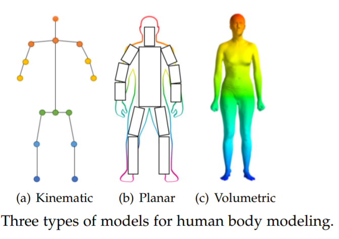
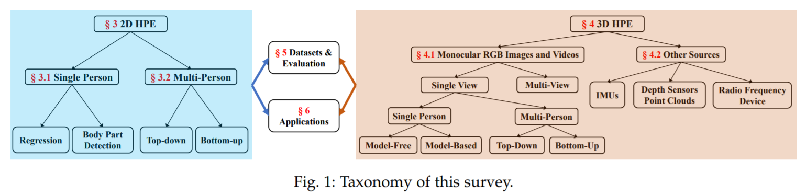
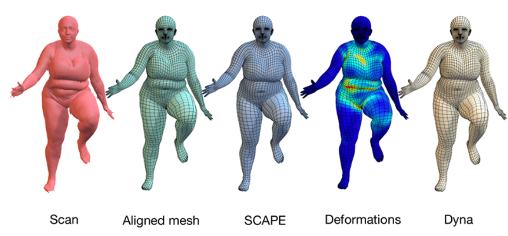
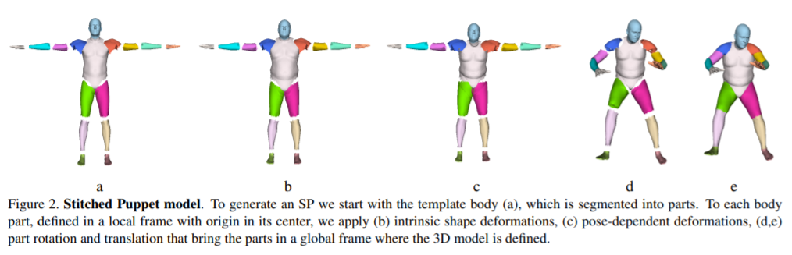
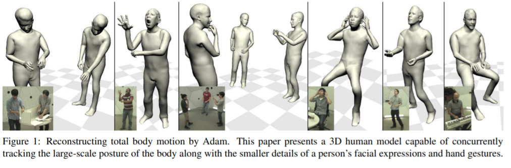
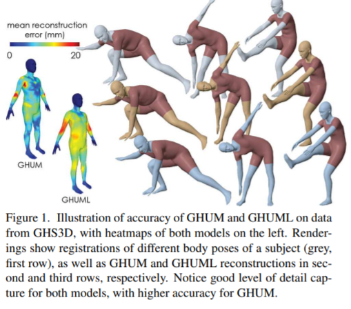
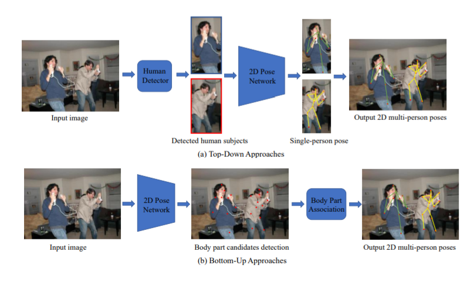
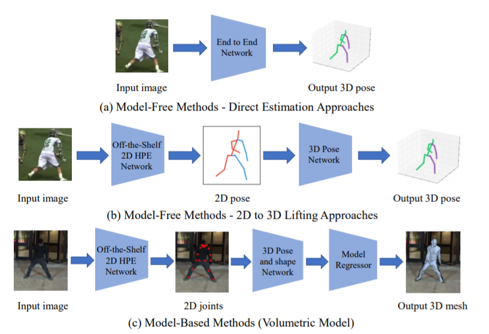
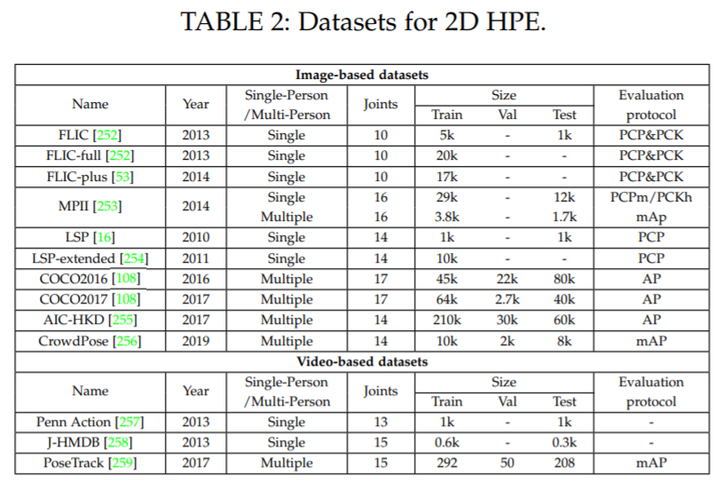
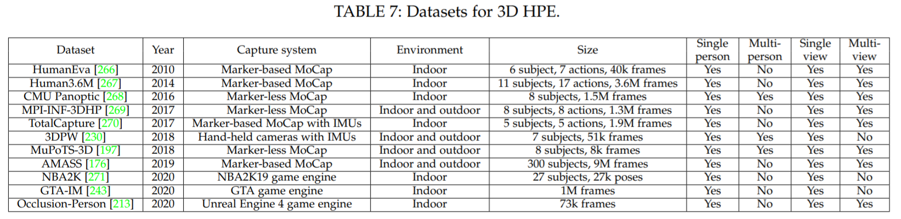

# [CV]Deep Learning-Based Human Pose Estimation: A Survey
2021-01-02  
preprint  
[code](https://github.com/zczcwh/DL-HPE)  
서베이 논문. 기본 지식 쌓기에 좋음

## 요약
Human Pose Estimation(이하 HPE)는 이미지 또는 비디오 내에서 사람의 신체 부위의 위치를 특정(locate)하고 인체 구조 표현 (e.g. 골격 표현)을 구축(associate)하는 것을 목표로 한다.  
Human Computer Interaction, Motion Analysis, Augmented Reality, Virtual Reality 등의 다양한 응용 분야가 존재한다.  
최근 딥러닝 기술의 도입으로 성능이 비약적으로 발전했지만 여전히 **훈련 데이터 부족**, **깊이 모호성 (depth ambiguities)** 및 **가려짐 (occlusion)** 문제가 존재함.  

본고는 **2D 및 3D HPE 분야의 최신 딥러닝 기반 솔루션**을 **체계적 문헌 고찰 방법**으로 분석하고 이들의 성능을 입력 데이터 및 추론 과정을 기반으로 비교하는 포괄적인 리뷰 논문이다.  
본고는 2014년 이후로 출간된 240편 이상의 연구를 다루었으며, 2D/3D 자세 측정 데이터셋과 평가지표도 다루었다.  
유명한 데이터셋에 대해 검토된 여러 방법의 정량적인 성능 비교 결과를 요약 및 설명하였다.  
마지막으로, 앞으로의 관련 과제, 응용 방안, 향후 연구 방향으로 결론을 맺었다.  

## 1. 서론
HPE는 computer vision 분야에서 압도적인 분야로, 특정 이미지나 비디오 내에서 센서로 감지된 인체의 신체 구조를 측정하는 작업을 포함한다.  
HPE는 인체에 대한 기하학적 정보 및 행동정보를 제공하며, 이는 다양한 응용 분야에 사용될 수 있다. (예를들면, HCI, motion analysis, AR, VR, healthcare 등)  
최근 딥러닝 기술의 비약적인 발전에 따라, image classification, semantic segmentation, object detection 등의 다양한 분야에서 딥러닝을 이용한 HPE 솔루션도 기존 computer vision 솔루션의 성능을 능가하는 모습을 보였다.  
HPE 분야 또한 딥러닝 기술을 차용하면서 주목할만한 성과 개선이 보고되었다.  
그러나, occlusion(가림), 훈련 데이터 부족, depth ambiguity 문제는 여전히 극복하기 어려운 문제이다.  

단일 인체 2D HPE 문제는 딥러닝 기술을 이용하여 쉽게 높은 성능을 달성할 수 있다.  
최근 주목받는 문제는 복잡한 배경에서 occlusion 정도(가린 정도)가 심한 다수 인체 자세 측정이다.  

반면, 3D HPE는 정밀한 3D 자세 표기를 확보하는 것이 2D HPE에서보다 어렵다.  
통제된 실험 환경에서 모션 캡처 시스템을 사용하면 3D 자세 표현을 얻을 수 있으나, 실무에서 해당 실험 환경을 구현하는 데에는 한계가 있다.  
monocular 3D HPE의 경우, 가장 큰 도전과제는 depth ambiguities이다.  
multi-view의 경우, viewpoint association을 가장 중요하게 다루어야 한다.  
몇몇 연구는 depth sensor, inertial measurement units(IMUs), radio frequency device 등의 센서를 사용하기도 하지만, 이러한 접근방식은 대체로 가성비가 좋지 않고 특수 목적 장비가 필요하다.  

HPE 분야의 비약적인 발전을 고려하여, 본고에서는 최근 이 분야의 동향을 파악하고 현재 딥러닝 기반 2D 및 3D HPE 에 대한 명확한 청사진을 제공하기 위해 주요 연구의 성과를 요약하고자 한다.  

### 1-1. 사전연구 및 본고와의 차이점
1. A survey of computer vision-based human motion capture (CVIU, 2001)
2. A survey of advances in vision-based human motion capture and analysis (CVIU, 2006)
3. Vision-based human motion analysis: An overview (CVIU, 2007)
4. Advances in view-invariant human motion analysis: A review (TSMCS, 2010)
5. Human pose estimation and activity recognition from multi-view videos:
Comparative explorations of recent developments (JSTSP, 2012)
6. A survey of human pose estimation: the body parts parsing based methods (JVCIR, 2015)
7. Human pose estimation from monocular images: A comprehensive survey (Sensors, 2016)
8. 3d human pose estimation: A review of the literature and analysis of covariates (CVIU, 2016)
9. Monocular human pose estimation: a survey of deep learning-based methods (CVIU, 2020)
10. The progress of human pose estimation: a survey and taxonomy of models
applied in 2D human pose estimation (IEEE, 2020)

1~4번 선행연구는 모션캡처에 관점을 둔 내용이며 pose estimation 뿐만 아니라 tracking, action recognition에 관한 내용도 담고있음.  
5번 연구는 2012년 이전의 3D 자세 측정에 관한 내용을 담고 있음.  
6번 연구는 신체부위 parsing을 주요 골자로 하는 single-view 및 multi-view HPE 연구를 담고 있음.  
5번과 6번 연구는 대체로 딥러닝을 사용하지 않은 관습적인 방법을 설명하고 있음.  
전통적인 방법과 딥러닝을 이용한 방법을 모두 담은 연구는 7번 연구이나, 딥러닝 접근방식에 대한 설명이 적음.  
8번 연구는 RGB input을 이용하는 3D HPE 방법을 다루고 있음.  
9번 연구는 single-view HPE를 전통적인 방법부터 2019년까지의 최신 딥러닝 방법까지 요약하고 있음.  그러나, 2D HPE 및 3D single-view만을 다루고 있음.  
10번 연구는 2D HPE만을 다루고 있음.  

본고는 선행연구에서 다루지 못했던 부분을 다루고 최근 딥러닝 기반 솔루션에 대한 체계적인 탐색 과정을 거칠뿐 아니라 유명 데이터셋에 대한 성능 비교, 각 솔루션의 응용, 그에 대한 종합 토론까지 다룰 것이다.  

### 1.2 본고의 개요
다음 섹션부터 딥러닝 기반 HPE 분야의 발전에 대하여 여러가지 관점에서 분석하고자 한다.  
먼저 인체 구조 모델링 기법은 다음과 같이 kinematic, planar, volumetric으로 나뉜다.  

HPE는 크게 2D와 3D로 나뉜다.  

2D HPE 방법은 사람의 수에 따라 single-person 및 multi-person으로 나뉜다.  
single-person의 하위분류로는 두가지 방법이 존재한다. 
1. regression : input image로부터 딥러닝 회귀 기술을 이용하여 신체 관절 좌표를 바로 뽑아내는 것을 말한다.  
2. body part detection : 두가지 단계로 이루어진다. 첫째로 각 신체부위(keypoint)에 대한 위치 신뢰도를 나타내는 히트맵을 생성한다. 두번째로 이 히트맵으로 측정한 keypoint의 위치들을 전체 자세 또는 골격구조로 연결한다.  

multi-person의 하위분류로는 두가지 방법이 존재한다.  
1. top-down methods : 사람을 먼저 감지한 뒤 single-person HPE를 각 사람마다 적용한다.  
2. bottom-up methods : 사람의 수를 모른채 키포인트 감지(히트맵 생성)를 먼저 수행하고 각 키포인트들의 집합을 각 개인의 자세로 연결한다. 이 경우 예를들어 '코'에 대한 히트맵에는 single-person HPE와 달리 다수의 붉은 지점(최고점)이 관찰될 것이다.  

3D HPE 방법은 input source의 종류에 따라 1. monocular RGB 이미지와 2. 기타 센서 (IMU, depth sensor, radio frequency device)로 나뉘어진다.  
대부분의 방법은 monocular RGB image & video에 속한다.  
monocular RGB는 또다시 single-view 및 multi-view로 나뉜다.  
1. single-view : 하나의 관점(카메라)만을 이용하는 방식이며 single-person 및 multi-person으로 또다시 나뉜다.  
2. multi-view : 대부분 multi-person 으로 이용된다.  

또한, 2D와 3D HPE의 pipeline에 따라, 일반적으로 사용되는 데이터셋 및 평가지표를 정리한 다음, 유망한 방법들의 결과를 비교하였다. 더하여 HPE의 다양한 응용 분야(AR/VR)를 언급하였다.  

위에서 정리한 본고의 내용을 도식으로 나타내면 다음과 같다.  

## 2. 인체 구조 모델링
인체의 구조를 모델링하는 것은 HPE의 중요한 측면 중 하나이며, input data로부터 keypoint와 feature를 표현하는 가장 기본적인 토대가 된다.  
예를 들면, 대부분의 HPE 방법은 N개의 joint로 이루어진 rigid kinematic model을 사용한다(N-joints rigid kinematic model).  
인체는 관절과 사지로 이루어진 복잡한 개체이며, 신체 운동학적 구조와 신체 형태 정보를 포함한다.  
전형적인 방법에서 모델링 기반 접근방식은 인체 자세를 추론하고 2D/3D 자세를 만들어내기 위해 사용되는 접근방식이다.  

크게 3가지로 나뉘는 이 모델링 타입 중 kinematic은 2D 및 3D HPE에 사용되는 가장 보편적인 모델링이며, planar 타입은 2D에, volumetric 타입은 3D HPE에 사용되는 모델링 방법이다.  

- Kinematic model : skeleton-based model 또는 kinematic chain model이라고도 불린다.  
관절을 점으로 하고 사지를 선으로 하는 그래프 형식으로 나타낸다.  
이 중에서도 pictorial structure model(PSM)은 널리 사용되는 그래프 모델이며, tree-structured model이라고도 불린다.  
kinematic model은 유연하고 직관적이라는 장점을 가지고 있어 2D 및 3D HPE에 두루 사용된다.  
다만 이 방법으로는 texture 및 shape 정보를 담지 못한다는 한계가 있다. 

- Planar model : kinematic보다 shape와 appearance 정보를 더 풍부하게 표현하기 위해 사용되는 모델이다.  
이 모델에서 신체부위는 보통 해당 면적에 근사하는 직사각형으로 표현된다.  
한 예로는 cardboard model이 있으며, 도식의 (b)가 그것이다.  
또다른 예로는 Active Shape Model(ASM)이 있으며, principal component analysis를 사용하여 전체 인체 그래프와 실루엣 정보를 표현한다.  

- Volumetric model : 3D 인체 재구성에 대한 높아지는 관심을 반영하며 많은 인체 모형이 다양한 인체 형태를 반영할 것을 요구하고 있다.  
여기에서는 딥러닝 기반 3D 자세추정에 쓰이는 몇몇 유명한 3D 인체 모델링에 대하여 논하고자 한다.  
    - [SMPL](https://eehoeskrap.tistory.com/436) : Skinned Multi-Person Linear model. 스킨이 씌워진 vertex-based 모델. (ECCV, 2016)
    
    - [DYNA](http://dyna.is.tue.mpg.de/) : Dynamix Human Shape in Motion. 다양한 체형의 현실적인 미세 움직임을 잡아내기 위해 전신 속도와 가속도, 신체부위별 각속도, 및 속도 가속도와 연조직 모양 계수를 사용한다.  
    또한 BMI 지수를 사용하여 체형에 따른 신체 변형을 표현한다. (ACM-TOG, 2015)
    
    - [Stitched Puppet Model](https://www.cv-foundation.org/openaccess/content_cvpr_2015/app/2B_022.pdf) : 부위 기반 그래픽모델이다.  
    각기 다른 3D 체형과 자세에 따른 shape 변수가 해당하는 그래프 노드 표현으로 변환된다.  
    각각의 신체부위는 각기 다른 저차원 state space로 표현되며, 그래프 노드 사이의 pairwise potentials를 기반으로 연결과어 마치 신체부위들을 짜깁기한 것 같은 모양이 완성된다. (CVPR, 2015)
    
    - [Frankenstein & Adam](https://arxiv.org/pdf/1801.01615.pdf) : 얼굴 및 손동작까지 자세히 표현하는 모델링. 여러 메쉬를 결합하여 구성한다. 몸은 SMPL을 사용하고, 얼굴에는 FaceWarehouse, 손은 전문가 리깅을 이용하였다. 아담모델은 프란켄슈타인 모델을 대용량 의복 정보를 이용하여 최적화한 모델이다. 아담모델은 머리카락과 의류 위치를 표현할 수 있다는 점에서 현실 조건을 더욱 잘 표현하고 있다. (CVPR, 2018)
    
    - [GHUM & GHUML(ite)](https://openaccess.thecvf.com/content_CVPR_2020/papers/Xu_GHUM__GHUML_Generative_3D_Human_Shape_and_Articulated_Pose_CVPR_2020_paper.pdf) : a fully trainable end-to-end deep learning pipeline 
    고해상도 전신 바디스캔 정보로 훈련되어 non-linear shape spaces, pose-space deformation correctives, skeleton joint center estimators, blend skinning function 등의 값을 추론할 수 있다.  (CVPR, 2020)
    

## 3. 2D Human Pose Estimation
2D HPE 방법은 이미지나 비디오에서 신체 주요 keypoint의 2D 위치 또는 공간 위치를 계산하는 방법이다.  
전통적인 방식은 신체부위에 따라 각기 다른 수작업 특징 추출 기술을 사용하였으며, 이 연구들에서 사람의 신체에 대한 전반적인 자세 표현을 위해 막대기 모양으로 표현하였다.  
최근 딥러닝 기반 접근방식으로 인해 현저한 성능 개선이 이루어졌다.  
지금부터 single-person 및 multi-person 시나리오에 따라 2D HPE를 살펴보겠다.  

### 3.1 2D single-person pose estimation
2D 단일 인체 자세 측정은 한 사람만이 나타나는 이미지 속에서 인체의 관절 위치를 특정하는 작업니다.  
사진 속에 한 명 이상의 사람이 있다면, 이미지를 한 사람 단위로 crop한 뒤 sub-image 별로 동일한 작업을 실시한다.  
이 과정은 upper-body detector 또는 full-body detector로 자동적으로 달성될 수 있다.  
보통 딥러닝을 이용하는 single-person pipeline에는 regression과 body part detection 두가지의 방법이 있을 수 있다.  

Regression : input image에서 관절 위치 또는 파라미터 값을 추출하는 end-to-end 프레임워크를 응용한다.  
Body part detection : 각 신체부위 또는 관절의 위치 근삿값을 추론하는 것을 목표로 한다. 주로 정답값의 포맷은 히트맵 표현이다. 보통 body part detection 이후 body part association 과정을 거쳐 전체 신체 골격 표현을 완성한다.  

#### 3.1.1 Regression
- DeepPose : AlexNet을 backbone으로 하여 구성한 cascaded dnn 회귀모델이다. 이 연구 결과로 인해 딥러닝 기반 기술로의 패러다임 쉬프트가 일어났다.  
- Iterative Error Feedback : IEF 는 self-correcting model로서 스스로 발생한 에러를 감지하고 인풋으로 입력하여 최초 오류를 점차 수정해나간다.  
- 더 좋은 특징 표현을 얻기 위한 한가지 유명한 방법은 multi-task learning이다. 예를 들면 pose estimation과 pose-based action recognition 두 가지 task를 동시에 학습하면 모델이 원래 task에 대해 더 잘 학습할 수 있다는 의도이다. 

#### 3.1.2 Body Part Detection
최근의 감지 방법은 자세 추정을 위해 히트맵 추론 문제를 다룬다.  
엄격히 얘기하면, 이 문제의 목표는 K개의 키포인트에 각각에 대한 K개의 히트맵을 계산하는 것이다.  
히트맵 내 한 픽셀의 값은 키포인트가 해당 좌표에 위치하고 있을 확률에 따른 색깔이다.  
타겟 히트맵(또는 ground-truth, 정답값)은 실제 정답값 좌표 주변에 일정 정도의 2D Gaussian을 적용하여 만들어진다.  
joint 좌표에 비해 히트맵을 사용하는 것이 가져다주는 이점은 하나의 점을 표현하는 좌표값에 비해 히트맵이 공간적 위치 개념을 더 잘 표현하기 때문에 훨씬 현실적인 오차값을 제공할 수 있다는 점이다.  
이에 최근 joint location을 표현하기 위해 heatmap 표현을 이용하는 연구가 늘고 있는 추세이다.  

- Convolutional Pose Machine : CNN 기반 sequential framework.  
다중 stage를 거쳐 key joint의 위치를 추론한다.  
각 stage의 CNN은 이전 단계의 2D belief maps로부터 더 정교한 body part location 예측을 새성한다.  

- Stacked Hourglass(SHG) : 반복되는 encoder-decoder 구조로 bottom-up 과 intermediate supervision, top-down precess를 반복 수행한다.  
SHG 신경망은 모든 scale에서의 정보를 얻기 위해 pooling layer와 upsampling layer가 연속적으로 이루어져 있다. 

- Adversarial PoseNet : Hourglass 신경망 기반의 pose generator와 두 개의 discriminators로 GAN 신경망 구성

### 3.2 2D multi-person pose estimation
single-person HPE에 비하여, multi-person HPE는 사람의 수를 파악하고 각각의 위치를 특정해야 한다는 점에서 더욱 어려운 점이 있다.  
이 문제 해결을 위한 multi-person HPE 방법은 top-down 또는 bottom-up 방법으로 나뉜다.  
Top-down 방법은 상용 person detector를 사용하여 이미지 내 각각의 사람 한 명만을 담은 box를 획득하고, box마다 single-person pose estimation을 수행하여 multi-person pose를 구성한다.  
이와는 달리 bottom-up 방법은 각 신체부위별로 찾을 수 있는 모든 객체를 찾은 다음 그들을 각각의 인체로 연결한다.  
Top-down 방법에서는 이미지 속 사람의 수가 컴퓨팅 리소스에 직접적인 영향을 끼치므로, 보통 bottom-up 방법이 top-down 방법보다 더 빠르다.  

#### 3.2.1 Top-down pipeline
탑다운 방식에는 두가지 중요한 부분이 있다.  
person bounding box를 얻기 위한 body detector로 무엇을 선정하는지와  
keypoint location을 얻기위해 무슨 single-person pose estimator를 쓰는지이다.  

여러 연구들은 HPE 신경망 내의 모듈 디자인과 성능 개선에 집중한다.  
예를 들면, 
- 고해상도 표현을 위한 히트맵을 생성하기 위해 Xiao et al. 은 **ResNet**에 몇 개의 deconvolutional layers를 추가하여 간단하지만 효과적인 구조를 완성하였다.  
- Sun et al. 은 새로운 HRNet을 소개하며 다중 해상도 subnetworks를 병렬로 구성하고 multi-scale fusion 작업을 반복함으로써 안정적인 고해상도 표현을 생성할 수 있음을 보였다.  
- 키포인트 위치 정확도를 높이기 위해, Wang et al. 은 2단계 그래프기반 범모델용 프레임워크인 Graph-PCNN을 소개하였다. 이 프레임워크는 대강의 키포인트 위치를 출력하는 localization subnet과 더 정교한 키포인트 위치 표현을 얻기 위한 graph pose refinement module로 이루어져있다.  

이미지 특성상 인체가 가리거나 공간 부족으로 잘린 경우가 있을 수 있다.  
이는 multi-person 환경에서 종종 나타나는 일이며, 특히 사지가 얽혀 있는 경우를 피할 수 없다.  
이 경우 human detector를 이용하는 첫번째 단계부터 실패할 확률이 높아진다.  
따라서 이 가림(occlusion) 또는 잘림(truncation)에 대한 안정성은 multi-person HPE 접근 방식에서 중요한 목표과제 중 하나이다.  
이 목표를 이루기 위하여 다음과 같은 다양한 연구가 있었다.  
- Iqbal and Gail : convolutional pose machine-based pose estimator를 사용하여 joint 후보를 탐색한다. 그 다음, integer linear programming(ILP)를 사용하여 joint-to-person association problem을 해결하고 심각한 occlusion이 발생하도 human body pose를 얻을 수 있도록 한다.  
- Fang et al. : regional multi-person pose estimation(RMPE) 접근방법으로 복잡한 이미지 내의 HPE 성능을 개선하였다.  특히, 이 RMPE 프레임워크는 3가지 부분으로 나뉜다. : Symmetric Spatial Transformer Network, Parametric Pose Non-Maximum-Suppression, Pose-Guided proposals Generator.
- Chen et al. : Cascaded Pyramid Network(CPN)을 사용하여 occlusion 문제를 완화하엿다.  이 구조는 두가지 부분으로 이루어진다. : GlobalNet과 RefineNet.

#### 3.2.2 Bottom-up pipeline
Bottom-up pipeline은 신체 부위 감지와 각 개인별 신체 부위 연결로 이루어진다.  
- Pishchulin et al. 은 Fast R-CNN 기반 body part detector인 DeepCut을 제안하였다.  
이 제안은 최초의 2 step bottom-up approach이다. 먼저 모든 신체 부위 후보를 뽑은 다음, 각 후보에 label을 붙이고 integer linear programming(ILP)을 이용하여 후보를 조합한다.  
그러나 이 방법은 컴퓨팅 리소스가 비싼 편이다.  
- Cao et al. 은 OpenPose라는 detector를 제안하였으며, 이는 Convolutional Pose Machine(CPMs)을 사용하여 히트맵을 통해 키포인트 좌표를 예측하고 Part Affinity Fields(PAFs)로 각 키포인트 간 위치와 방향을 표현하여 assembly 과정을 동시에 수행하여 성능을 크게 높였다.  
이후 여러 후속 연구가 진행되었으나, OpenPose 기반 연구는 저해상도 이미지와 occlusion이 발생하는 이미지에서 제대로 작동하지 않는다는 문제점이 있다.  
- occlusion 문제 해결을 위해, Kreiss et al.은 PifPaf라는 모델을 제안한다.  
PAFs 에 Part Intensity Field라는 개념을 더하여 joint association을 수행하였으며, OpenPose 기반 접근방식들 중 저해상도 및 occlusion에 대하여 성능 개선을 보였다.  

Bottom-up 접근방식에도 multi-task 구조가 차용된다.  
- Papandreou et al.은 PersonLab이라는 pose estimation 및 person segmentation 모듈을 제안하였다.  
- Kocabas et al.은 MultiPoseNet으로 불리는 human detection 및 semantic segmentation task 를 동시에 수행하는 pose residual net을 제안하였다.  

### 3.3 2D HPE 정리
정리하면, 2D HPE 분야에서 딥러닝 기술을 차용하면서부터 최근 몇 년간 상당히 중요한 발전이 이루어졌다.  
중요한 연구로는 2D single-person HPE인 DeepPose와 Stacked Hourglass Network,  
그리고 2D multi-person HPE에서 AlphaPose와 OpenPose 같은 연구가 있었다.  

비록 이 연구들이 충분히 좋은 성능 개선을 보여주기는 했지만, 여전히 문제는 남아있다.  
Regression 방식과 Body Part Detection 방식은 각각의 장단점을 지니고 있다.  

Regression 방식은 end-to-end framework로 input image와 output coordinates 사이의 비선형 관계를 배울 수 있어 빠르며 픽셀단위 정확도를 보이지만, 일반적으로 매우 비선형적이기 때문에 차선의 솔루션으로 여겨진다.  

Body Part Detection 방법은, 특히 히트맵을 이용한 프레임워크는 보다 널리 쓰이는 편이며, 이유는 1. 히트맵 각 픽셀에 대한 확률적 예측은 키포인트 위치 정확도를 개선시키며 2. 히트맵이 공간위치정보를 보존하여 더 풍부한 학습 정보를 제공하기 때문이다.  
그러나 히트맵 해상도에 따라 정밀도가 달라지며, 고해상도 히트맵을 사용할 수록 컴퓨팅 리소스가 많이 든다는 단점이 있다.  

top-down 및 bottom-up pipeline에 관하여는, 두 방법 모두 널리 쓰이고 있기 때문에 어떤 방법이 더 나은지 말하기가 어렵다.  
한 편으로는, top-down pipeline을 차용할 때에는 각 사람별로 이미지를 crop하기 때문에 배경 정보에 신경쓸 필요 없이 보다 정확한 히트맵을 생성할 수 있다.  
반면, bottom-up pipeline을 차용할 때에는 보다 빠르게 작업을 수행할 수 있다는 장점이 있다.  

2D HPE 분야에서 앞으로 해결해야 할 과제를 꼽아보면 다음과 같다. 
- Occlusion : 사람이 붐비는 환경(crowded scenario)에서 가림 정도가 심각한 경우.
- Computation efficiency : OpenPose와 같은 연구가 특정 하드웨어 사양(Nvidia GTX 1080Ti로 22 FPS)으로 실시간 서비스를 하는 수준을 달성하였지만, 리소스가 제한된 디바이스에서 실제로 구현하기는 어렵다. 이유는 실제 응용 프로그램(온라인 코칭, 게임, AR, VR)에서는 더 효율적인 모델이 있어야 실사용자 요구사항을 맞출 수 있을 것이다.  
- Rare Pose Data : 현재 2D HPE 데이터가 충분히 많지만, 넘어지거나 떨어지는 등 다양하고 비정상적인 자세에 대한 데이터는 부족하다. 획기적인 data generation 또는 augmentation 기술이 요구된다.  

## 4. 3D Human Pose Estimation
3D HPE는 3차원 공간상에 신체 좌표를 나타내는 것으로, 인간의 몸에 관한 광범위한 3D 구조 정보를 제공할 수 있다는 점에서 최근 관심을 얻고 있다.  
3D 영화, 애니메이션 산업, VR, 온라인 3D 액션 예측 등 다양한 응용 분야가 존재한다.  

2D HPE 분야에서 최근 비약적인 발전이 있었으나, 3D HPE는 여전히 도전과제로 남아있다.  
대부분의 현존하는 연구는 3D HPE 문제를 단시점 image or video로부터 접근하는데, 이는 3D를 2D로 투영하며 차원의 손실이 발생한다는 점에서 불량조건문제(처음부터 계산이 불가능하거나 매개변수의 값이 약간만 변해도 결과값이 크게 차이나는 문제) 또는 역문제로 여겨진다.  
다시점이 가능하거나 IMU 또는 LiDAR와 같은 센서가 도입된다면, 3D HPE 문제는 우량조건문제(답이 존재하며 그 답이 유일하게 결정될 수 있는 문제)가 될 수 있다.  
또다른 한계점은 딥러닝 모델이 엄청난 데이터를 필요로 하며 입력 데이터셋의 품질에 따라 차이가 많이 난다는 것이다.  
2D 자세 정답값의 경우 정확한 값을 비교적 쉽게 구할 수 있지만, 3D 자세 정답값을 얻는 일은 시간을 많이 소요하며 직접 labeling하기가 현실적으로 어렵다.  
또한, 데이터셋을 구축할 때 보통 실내 환경에서 제한된 일상적인 행동만을 관찰하기 때문에 한계가 있다.  
최근의 연구들은 cross-dataset inference를 통해 편향된 데이터셋으로 훈련된 모델이 일반화 능력에 한계가 있음을 보였다.  

### 4.1 monocular 3D HPE
단안 카메라는 2D 및 3D HPE 모두에서 가장 널리 쓰이는 센서이다.  
최근 딥러닝 기반 2D HPE 방법의 발전으로 3D HPE까지 연구가 확장되고 있다.  
구체적으로, 딥러닝 기반 3D HPE 방법은 두가지 카테고리로 나뉜다.  

#### 4.1.1 Single-view 3D HPE
단안 이미지 또는 비디오에서 3D 인체 자세를 복구하는 것은 자기 가림 문제, 타물체에 의한 가림 문제, depth ambiguities, 데이터 부족으로 인해 매우 복잡한 작업을 요한다.  
이는 심각한 불량조건 문제이며 각기 다른 3D 인체 자세도 2D로 투사할 경우 같은 자세가 될 수 있다는 문제점이 있다.  
게다가, 2D 신체 좌표 기반으로 구축된 모델의 경우 2D 신체 좌표를 약간만 조정해도 3D 공간의 자세 왜곡이 크게 일어날 수 있다.  
single-person에 비해 multi-person은 더더욱 복잡하다.  

- Single-person 3D HPE

위에서 언급한 인체모형 파라미터를 쓰지 않는 Model-Free 기법과 인체모형 파라미터를 사용하는 Model-based 기법으로 나뉜다.  

#### 4.1.2 Multi-view 3D HPE
다양한 각도의 view를 사용하면, partial occlusion 문제를 크게 개선할 수 있다.  
이 각도에서는 가리던 부분이 저 각도에서는 보일 수 있기 때문이다.  
3D multi-view HPE에서는, 각기 다른 카메라 사이의 상응하는 지점에 대한 관계를 먼저 알아내야 한다.(association problem)  
- G. Pavlakos, X. Zhou, K. G. Derpanis, and K. Daniilidis, “Harvesting multiple views for marker-less 3d human pose annotations,”
in CVPR, 2017.
- H. Qiu, C. Wang, J. Wang, N. Wang, and W. Zeng, “Cross view
fusion for 3d human pose estimation,” in ICCV, 2019.
- J. Liang and M. C. Lin, “Shape-aware human pose and shape
reconstruction using multi-view images,” in ICCV, 2019.
- J. Dong, W. Jiang, Q. Huang, H. Bao, and X. Zhou, “Fast and
robust multi-person 3d pose estimation from multiple views,” in
CVPR, 2019.
- H. Tu, C. Wang, and W. Zeng, “Voxelpose: Towards multi-camera
3d human pose estimation in wild environment,” in ECCV, 2020.

위 연구들은 association problem을 해결하기 위해 인체 모델의 모델 파라미터를 2D projection 했을때의 2D 자세와 일치하도록 최적화하였다.  

- M. Burenius, J. Sullivan, and S. Carlsson, “3d pictorial structures
for multiple view articulated pose estimation,” in CVPR, 2013.

널리 사용된 3D pictorial structure model 또한 그런 모델이다.  
그러나 위 방법은 보통 컴퓨팅 리소스가 많이 들며, 특히 multi-person 세팅일수록 더욱 코스트가 비싸다.  

- H. Rhodin, J. Sporri, I. Katircioglu, V. Constantin, F. Meyer, ¨
E. Muller, M. Salzmann, and P. Fua, “Learning monocular 3d ¨
human pose estimation from multi-view images,” in CVPR, 2018

의 경우 처음으로 multi-view consistency constraint를 신경망에 도입하였다. 그러나 이는 3D 훈련 데이터가 굉장히 많이 필요하다. 이를 극복하기 위해, 

- H. Rhodin, M. Salzmann, and P. Fua, “Unsupervised geometryaware representation for 3d human pose estimation,” in ECCV,2018.

encoder-decoder 프레임워크로 geometr-aware 3D latent representation을 학습하고 3D annotation 없이 background segmentation을 학습할 수 있도록 하였다.  

- X. Chen, K. Lin, W. Liu, C. Qian, and L. Lin, “Weakly-supervised
discovery of geometry-aware representation for 3d human pose
estimation,” in CVPR, 2019.
- H. Chen, P. Guo, P. Li, G. H. Lee, and G. Chirikjian, “Multiperson 3d pose estimation in crowded scenes based on multi-view
geometry,” in ECCV, 2020.
- R. Mitra, N. B. Gundavarapu, A. Sharma, and A. Jain, “Multiviewconsistent semi-supervised learning for 3d human pose estimation,” in CVPR, 2020.
- U. Iqbal, P. Molchanov, and J. Kautz, “Weakly-supervised 3d
human pose learning via multi-view images in the wild,” in
CVPR, 2020.
- Y. Zhang, L. An, T. Yu, x. Li, K. Li, and Y. Liu, “4d association
graph for realtime multi-person motion capture using multiple
video cameras,” in CVPR, 2020.
- C. Huang, S. Jiang, Y. Li, Z. Zhang, J. Traish, C. Deng, S. Ferguson,
and R. Y. D. Xu, “End-to-end dynamic matching network for
multi-view multi-person 3d pose estimation,” in ECCV, 2020.

위 연구들은 consistency constraints를 이용하여 모든 관점에서 3D 자세를 복원할 수 있는 multi-view matching framework를 제안하였다.  

- Z. Zhang, C. Wang, W. Qiu, W. Qin, and W. Zeng, “Adafuse:
Adaptive multiview fusion for accurate human pose estimation in
the wild,” IJCV, 2020.

위 연구는 multi-view 이미지의 2D 키포인트 히트맵을 집약하여 카메라 파라피터 캘리브레이션 기반의 3D pictorial structure model로 만들었다.  
그러나 이 경우 카메라 세팅이 바뀌면 모델을 다시 훈련해야한다.  

- M. Habermann, W. Xu, M. Zollhoefer, G. Pons-Moll, and
C. Theobalt, “Deepcap: Monocular human performance capture
using weak supervision,” in CVPR, 2020.

위 연구는 non-rigid 3d deformation parameter를 추론하여 multi-view 이미지로부터 3d 인체 mesh를 복구하고자 하였다.  

- A. Kadkhodamohammadi and N. Padoy, “A generalizable approach for multi-view 3d human pose regression,” arXiv preprint
arXiv:1804.10462, 2018.
- M. Kocabas, S. Karagoz, and E. Akbas, “Self-supervised learning
of 3d human pose using multi-view geometry,” in CVPR, 2019.

위 연구들은 epipolar geometry를 도입하여 복구한 3D multi-view 자세들을 매칭하고 이를 새로운 카메라 세팅에도 일반화할 수 있도록 하였다.  
그러나 여기서 cycle consistency constraint를 사용하지 않은 매칭은 3D 자세 복구의 정확성을 보장하지 않는다는 점을 주의해야한다.  

- A. Pirinen, E. Gartner, and C. Sminchisescu, “Domes to drones: ¨
Self-supervised active triangulation for 3d human pose reconstruction,” in NeurIPS, 2019

위 연구는 self-supervised reinforcement learning 접근 방식을 사용하여 적은 수의 카메라로도 triangulation을 이용하여 3D 자세를 복구하도록 하였다.  

multi-view HPE에서는 정확성도 중요하지만, 가벼운 아키텍처와 빠른 추론 시간, 그리고 카메라 세팅을 바꿀 때 얼마나 효율적으로 바꿀 수 있는지도 중요하게 고려해야한다.  

- L. Chen, H. Ai, R. Chen, Z. Zhuang, and S. Liu, “Cross-view
tracking for multi-human 3d pose estimation at over 100 fps,” in
CVPR, 2020.

위 연구의 경우 iteratvie processing strategy를 사용하여 각각의 2D 자세를 3D 포즈에 매칭시키고, 3D 포즈는 지속적으로(반복적으로) 업데이트하도록 하였다.  
앞선 연구들은 카메라 개수에 따라 런타임 시간 초과가 일어날 수 있으나, 이 방법은 선형 시간복잡도를 보장한다.  

- E. Remelli, S. Han, S. Honari, P. Fua, and R. Wang, “Lightweight
multi-view 3d pose estimation through camera-disentangled
representation,” in CVPR, 2020.

위 연구는 각 시점의 이미지를 통일된 latent representation으로 인코딩하여 카메라 시점으로부터 피처맵을 분리하였다.  
이 2D 표현을 GPU 기반 Direct Linear Transform을 이용하여 3D 자세로 리프트업 한다.  

- R. Xie, C. Wang, and Y. Wang, “Metafuse: A pre-trained fusion
model for human pose estimation,” in CVPR, 2020.

위 연구는 multi-view fusion scheme의 일반화 성능을 높이기 위해 사전모델을 제안하여 새로운 카메라 환경에 적은 데이터셋으로도 용이하게 적용시킬 수 있도록 하였다.  
또한 이러한 환경 변화 조정을 위한 일반적인 fusion model의 최적 초기값을 찾기 위한 범모델용 메타 학습 프레임워크를 배포하였다.  

### 4.2 3D HPE from other sources
비록 단안 컬러 카메라를 사용하는 것이 가장 일반적인 방법이지만, 다른 센서(depth sensor, IMUs, radio frequency device)또한 사용할 수 있다.  

- Depth and point cloud sensors: 최근 가성비로 3D vision 분야에서 주목받고 있는 센서이다.  
depth ambiguity 문제를 완화할 수 있다.  

    - T. Yu, J. Zhao, Z. Zheng, K. Guo, Q. Dai, H. Li, G. Pons-Moll, and
    Y. Liu, “Doublefusion: Real-time capture of human performances
    with inner body shapes from a single depth sensor,” IEEE TPAMI,2019.
    - F. Xiong, B. Zhang, Y. Xiao, Z. Cao, T. Yu, J. Zhou Tianyi, and
    J. Yuan, “A2j: Anchor-to-joint regression network for 3d articulated pose estimation from a single depth image,” in ICCV, 2019.
    - A. Kadkhodamohammadi, A. Gangi, M. de Mathelin, and
    N. Padoy, “A multi-view rgb-d approach for human pose estimation in operating rooms,” in WACV, 2017.
    - T. Zhi, C. Lassner, T. Tung, C. Stoll, S. G. Narasimhan, and M. Vo,
    “Texmesh: Reconstructing detailed human texture and geometry
    from rgb-d video,” in ECCV, 2020.
    - C. R. Qi, H. Su, K. Mo, and L. J. Guibas, “Pointnet: Deep learning
    on point sets for 3d classification and segmentation,” in CVPR, 2017.
    - C. R. Qi, L. Yi, H. Su, and L. J. Guibas, “Pointnet++: Deep
    hierarchical feature learning on point sets in a metric space,”
    in NeurIPS, 2017.
    - H. Jiang, J. Cai, and J. Zheng, “Skeleton-aware 3d human shape
    reconstruction from point clouds,” in ICCV, 2019.
    - K. Wang, J. Xie, G. Zhang, L. Liu, and J. Yang, “Sequential 3d
    human pose and shape estimation from point clouds,” in CVPR, 2020.
- IMUs : Wearable Inertial Measurement Units로 물체 가림 및 의류로 인한 장애 현상을 피할 수 있다.  
다만 자이로센서 편향에 의해 발생하는 drift problem이 있을 수 있다.  
    - T. von Marcard, B. Rosenhahn, M. J. Black, and G. Pons-Moll,
    “Sparse inertial poser: Automatic 3d human pose estimation from
    sparse imus,” in Computer Graphics Forum, 2017.
    - T. von Marcard, R. Henschel, M. J. Black, B. Rosenhahn, and
    G. Pons-Moll, “Recovering accurate 3d human pose in the wild
    using imus and a moving camera,” in ECCV, 2018.
    - Y. Huang, M. Kaufmann, E. Aksan, M. J. Black, O. Hilliges, and
    G. Pons-Moll, “Deep inertial poser: Learning to reconstruct human
    pose from sparse inertial measurements in real time,” ACM TOG, 2018.
    - Z. Zhang, C. Wang, W. Qin, and W. Zeng, “Fusing wearable imus
    with multi-view images for human pose estimation: A geometric
    approach,” in CVPR, 2020.
    - F. Huang, A. Zeng, M. Liu, Q. Lai, and Q. Xu, “Deepfuse: An
    imu-aware network for real-time 3d human pose estimation from
    multi-view image,” in WACV, 2020.
- Radio Frequency Device : RF signal 로 사람의 위치를 특정할 수도 있다.  
RF 기반 센싱 시스템의 장점은 시각데이터가 아니기 때문에 프라이버시 보호율이 높다는 것이다.  
그러나 비교적 낮은 공간 해상도 때문에 자세 정확도가 떨어지는 경향이 있다.  

## 5 Datasets and Evaluation Metrics

### 2D HPE 데이터셋
- 딥러닝 이전 데이터, 현재는 수량 부족 및 종류 부족으로 잘 쓰지 않음
    - **Buffy Stickmen** : V. Ferrari, M. Marin-Jimenez, and A. Zisserman “Progressive search space reduction for human pose estimation,” in CVPR, 2008.
    - **ETHZ PASCAL Stickmen** : M. Eichner, V. Ferrari, and S. Zurich, “Better appearance models for pictorial structures.” in BMVC, 2009.
    - **We are Family** : M. Eichner and V. Ferrari, “We are family: Joint pose estimation of multiple persons,” in ECCV, 2010.
    - **Video Pose 2** : B. Sapp, D. Weiss, and B. Taskar, “Parsing human motion with stretchable models,” in CVPR, 2011.
    - **Sync. Activities** : M. Eichner and V. Ferrari, “Human pose co-estimation and applications,” IEEE TPAMI, 2012
    - **PASCAL Person Layout** : M. Everingham, L. Van Gool, C. K. Williams, J. Winn, andA. Zisserman, “The pascal visual object classes (voc) challenge,” IJCV, 2010.
    - **Sport** : Y. Wang, D. Tran, and Z. Liao, “Learning hierarchical poselets for human parsing,” in CVPR, 2011.
    - **UIUC people** : L.-J. Li and L. Fei-Fei, “What, where and who? classifying events by scene and object recognition,” in ICCV, 2007.
- 딥러닝 이후
    
    - **Frames Labeled in Cinema(FLIC)** : 할리우드 영화의 이미지.
     https://bensapp.github.io/flic-dataset.html
    - **Leeds Sports Pose(LSP)** : Flickr 커뮤니티 내의 스포츠 이미지.
     https://sam.johnson.io/research/lsp.html
    - **Max Planck Institute for Informatics (MPII) Human Pose Dataset** : articulated HPE의 유명한 데이터셋  
     http://human-pose.mpi-inf.mpg.de/#
    - **Microsoft Common Objects in Context (COCO)** : 가장 널리 쓰이는 대용량 데이터셋이며, object detection, image segmentation task에도 쓰임. 연도별로 여러 종류가 존재한다.  
     https://cocodataset.org/#home
    - **AI Challenger Human Keypoint Detection (AIC-HKD)** : 2D HPE 데이터셋 중 가장 큰 용량의 훈련데이터. 인터넷 검색 엔진을 통해 수집, 일상 자세 중심.
     https://challenger.ai/
    - **CrowdPose Dataset** : 최신 데이터셋으로 붐비고 가림이 심한 상황에 초점을 맞춘 데이터셋. 
     https://github.com/Jeff-sjtu/CrowdPose
    - **Pen Action Dataset** : 스포츠 관련 동작이며 Amazon Mechanical Turk를 이용하여 라벨링함  
     http://dreamdragon.github.io/PennAction/
    - **Joint-annotated Human Motion Database (J-HMDB)** : 일상생활 & 가벼운 운동 동작
     http://jhmdb.is.tue.mpg.de/
    - **PoseTrack Dataset** : multi-person HPE를 위한 대용량 데이터셋
     https://posetrack.net/

### 2D HPE 평가지표
- Percentatge of Correct Parts (PCP)
- Percentage of Correct Keypoints (PCK)
- Average Precision (AP) and Average Recall (AR)

### 3D HPE 데이터셋

- **HumanEva** : 7편의 캘리브레이션 된 비디오  
http://humaneva.is.tue.mpg.de/
- **Human3.6M** : 가장 널리 쓰이는 실내 데이터셋  
http://vision.imar.ro/human3.6m/
- **MPI-ING-3DHP** : 복잡한 운동 동작, 동적인 행동 위주  
http://gvv.mpi-inf.mpg.de/3dhp-dataset/
- **TotalCapture Dataset**  : 걷기, 뛰기, 프리스타일 등의 일상 동작
https://cvssp.org/data/totalcapture/
- **CMU Panoptic Dataset** : 마커리스 모션캡처 시스템을 따랐다.  
domedb.perception.cs.cmu.edu/
- **3DPW Dataset** : 쇼핑, 계단, 버스타기 등 일상 생활 동작 위주  
https://virtualhumans.mpi-inf.mpg.de/3DPW/
- **MuCo-3DHP Dataset** : MPI-INF-3DHP과 3D 정답값을 합치고 Data augmentation 수행  
http://gvv.mpi-inf.mpg.de/projects/SingleShotMultiPerson/
- **MuPoTS-3D Dataset** : 5가지 실내상황과 15가지 실외 상황 반영. occlusion 등 난이도 있는 상황 데이터 존재  
http://gvv.mpi-inf.mpg.de/projects/SingleShotMultiPerson/
- **AMASS Dataset** : SMPL 모델로 인체 동작을 표현한 대용량 데이터셋  
https://amass.is.tue.mpg.de/
- **NBA2K Dataset** : NBA2K19라는 비디오 게임에서 얻은 이미지  
https://github.com/luyangzhu/NBA2K-dataset
- **GTA-IM Dataset** : GTA 비디오 게임에서 얻은 이미지  
https://people.eecs.berkeley.edu/∼zhecao/hmp/
- **Occlusion-Person Dataset** : occlusion에 초점을 맞춘 데이터셋
https://github.com/zhezh/occlusion_person

### 3D HPE 평가지표
- MPJPE (Mean Per Joint Position Error)
- PMPJPE (Reconstruction Error)
- NMPJPE : normalized MPJPE
- MPVE (Mean Per Vertex Error)
- 3DPCK (3D Percentage of Correct Keypoint)

### 주요 학회 및 challenge
|이름|상세|url|
|-----|-----------------|-------------------------------------------|
| ICCV 2017 | PoseTrack Challenge |https://posetrack.net/workshops/iccv2017|
| ECCV 2018 | PoseTrack Challenge: Articulated People Tracking in the Wild | https://posetrack.net/workshops/eccv2018/|
| CVPR 2018 | 3D humans 2018: 1st International workshop on Human pose, motion, activities and shape |https://project.inria.fr/humans2018/#|
| CVPR 2019 | 3D humans 2019: 2nd International workshop on Human pose, motion, activities and shape |https://sites.google.com/view/humans3d/|
| CVPR 2019 | Workshop On Augmented Human: Human-centric Understanding |https://vuhcs.github.io/vuhcs-2019/index.html|
| CVPR 2020 | Towards Human-Centric Image/Video Synthesis |https://vuhcs.github.io/|
| ECCV 2020 | 3D poses in the wild challenge |https://virtualhumans.mpi-inf.mpg.de/3DPW Challenge/|
| ACM Multimedia 2020 | Large-scale Human-centric Video Analysis in Complex Events |http://humaninevents.org/|

## 6. Application
### Action recognition, prediction, detection, tracking
- F. Angelini, Z. Fu, Y. Long, L. Shao, and S. M. Naqvi, “Actionxpose:
A novel 2d multi-view pose-based algorithm for real-time human
action recognition,” arXiv preprint arXiv:1810.12126, 2018.
- S. Yan, Y. Xiong, and D. Lin, “Spatial temporal graph convolutional
networks for skeleton-based action recognition,” in AAAI, 2018.
- A. Markovitz, G. Sharir, I. Friedman, L. Zelnik-Manor, and S. Avidan, “Graph embedded pose clustering for anomaly detection,”
in CVPR, 2020.
- J. J. Sun, J. Zhao, L.-C. Chen, F. Schroff, H. Adam, and T. Liu,
“View-invariant probabilistic embedding for human pose,” in
ECCV, 2020.
- S. Das, S. Sharma, R. Dai, F. Bremond, and M. Thonnat, “Vpn: ´
Learning video-pose embedding for activities of daily living,” in
ECCV, 2020.

### Action correction and online coaching
- J. Wang, K. Qiu, H. Peng, J. Fu, and J. Zhu, “Ai coach: Deep human
pose estimation and analysis for personalized athletic training
assistance,” in ACM MM, 2019.

### Clothes parsing
- Y. Li, C. Huang, and C. C. Loy, “Dense intrinsic appearance flow
for human pose transfer,” in CVPR, 2019.
- C. Patel, Z. Liao, and G. Pons-Moll, “Tailornet: Predicting clothing
in 3d as a function of human pose, shape and garment style,” in
CVPR, 2020.

### Animation, movie, game
- N. S. Willett, H. V. Shin, Z. Jin, W. Li, and A. Finkelstein,
“Pose2pose: pose selection and transfer for 2d character animation,”
in IUI, 2020.
- J. Liu, H. Fu, and C.-L. Tai, “Posetween: Pose-driven tween
animation,” in ACM Symposium on User Interface Software and
Technology, 2020.

### AR / VR
- C. Weng, B. Curless, and I. Kemelmacher-Shlizerman, “Photo
wake-up: 3d character animation from a single photo,” in CVPR, 2019.
- H. Zhang, C. Sciutto, M. Agrawala, and K. Fatahalian, “Vid2player:
Controllable video sprites that behave and appear like professional
tennis players,” arXiv preprint arXiv:2008.04524, 2020.

### Healthcare
- M. Lu, K. Poston, A. Pfefferbaum, E. V. Sullivan, L. Fei-Fei, K. M.
Pohl, J. C. Niebles, and E. Adeli, “Vision-based estimation of mdsupdrs gait scores for assessing parkinson’s disease motor severity,”
arXiv preprint arXiv:2007.08920, 2020.
- Y. Gu, S. Pandit, E. Saraee, T. Nordahl, T. Ellis, and M. Betke,
“Home-based physical therapy with an interactive computer vision
system,” in ICCV Workshops, 2019.
- W. Chen, Z. Jiang, H. Guo, and X. Ni, “Fall detection based on
key points of human-skeleton using openpose,” Symmetry, 2020.
- K. Chen, P. Gabriel, A. Alasfour, C. Gong, W. K. Doyle, O. Devinsky, D. Friedman, P. Dugan, L. Melloni, T. Thesen et al., “Patientspecific pose estimation in clinical environments,” JTEHM, 2018

## 7. 결론 및 제언
미래에 나아갈 수 있는 방향 몇가지.
- HPE의 Domain adaptation : 신생아 또는 미술작품 내의 human pose annotation data는 그리 많지 않다. 이러한 도메인 갭을 줄이기 위한 최근의 경향은 GAN-based learning 접근방식을 사용하는 것이다.
- SMPL, SMPLify, SMPL-X, GHUM & GHUML, Adam과 같은 인체 모형은 mesh 표현법을 사용한다. mesh의 퀄리티는 유지하면서 파라미터 수를 줄일 방법이 절실히 요구된다. 또한, 사람들은 각기 다른 체형과 움직임을 가진다. 더 효율적으로 이를 반영하기 위해 BMI 지수 또는 실루엣을 반영할 필요가 있다.  
- 현재 3D 상황에서는 대부분 사람들 사이의 상호작용 상황을 무시하고 있다. 이에 대한 연구가 더 필요하다.  
- MPJPE와 같은 평가지표는 움직임의 부드러움, 현실성과 같은 요소는 고려하지 않는다. 더 좋은 평가지표가 필요하다.  
- 현재 대부분의 데이터셋은 고화질 이미지이기 때문에 이들로 훈련된 모델은 저화질 인풋에 대해 제대로 동작하지 않을 우려가 있다. contrastive learning scheme 등을 도입하여 개선할 여지가 있는 듯 보인다.  
- DNN은 adversarial attack에 약하다. 약간의 노이즈가 심각한 결함으로 이어질 수 있다.  

