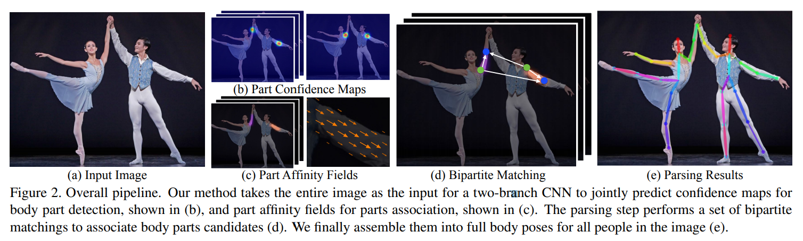
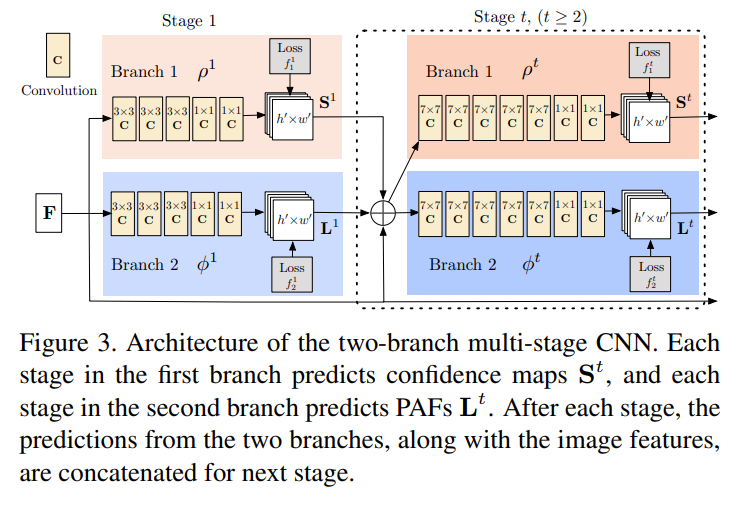
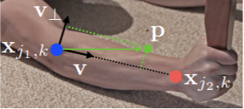
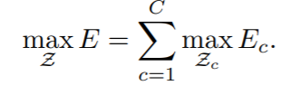
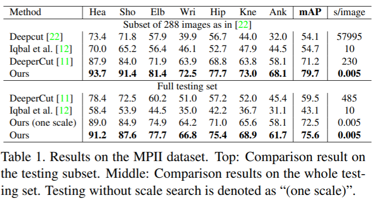

# [Realtime Multi-Person 2D Pose Estimation using Part Affinity Fields](https://arxiv.org/pdf/1611.08050v2.pdf)

[official codebase](https://github.com/ZheC/Realtime_Multi-Person_Pose_Estimation)  

의역 및 오역 다수

## Abstract
한 이미지 내의 여러 사람에 대한 2D 자세를 탐지하는 효율적인 접근방식을 소개한다.  
이 접근방식은 우리가 PAFs(Part Affinity Fields) 라고 부르는 *비모수 표현법**(non-parametric representation)을 사용하여 개개인의 신체 부위를 연결한다.  
이 아키텍처는 global context를 인코딩하여 사람 수에 관계 없이 높은 정확도로 실시간 탐지를 가능하게 하는 greedy bottom-up parsing step을 가능하게 한다.  

> :question: 비모수 표현법 (non-parametric representation)  
선험적 확률에 의존하지 않고 주어진 데이터에서 직접 확률을 계산하여 검정하는 방식

이 아키텍처는 동일한 순차 예측 프로세스의 두 분기를 통해 동시에 신체부위의 위치와 각 부위간 연관성을 학습하도록 설계되었다.  
우리의 방법은 inaugural COCO 2016 keypoints challenge에서 1위를 달성하였으며, MPII Multi-Person benchmark 에서 performance와 efficiency 두 부문에서 SOTA 성능을 현저히 능가하였다.  

## Introduction
2D 인간 자세 측정 연구들은 대부분 해부학적 키포인트 또는 부위를 특정하는 것을 목적으로 하여 개인의 신체 부위를 찾는 데에 집중하고 있다.  
한 이미지 내의 여러 사람들의 자세를 추론하는 것은, 특히 그 사람들이 사회적(친밀한) 자세를 취하고 있는 경우, 다른 경우와는 달리 특이한 문제가 몇 가지 발생한다.  

첫째, 각 이미지는 특정할 수 없는 위치에 특정할 수 없는 크기로 특정할 수 없는 횟수만큼의 사람들을 포함한다.  

둘째, 사람들 사이의 상호작용이 복잡한 공간적 추론을 야기한다. 접촉, 가림, 얽힘(팔짱) 등이 신체 부위를 특정하는 데에 어려움을 가중시킨다.  

셋째, 런타임 복잡도가 사람 수에 따라 증가하는 경향이 있으며, 이는 실시간 퍼포먼스에 악영향을 끼친다.  

이를 해결하기 위한 대부분의 접근방식은 인체 탐지기를 이용하여 인체가 인식 될 때마다 단일 인체 자세 측정을 수행하는 것이다.  
이러한 top-down 접근방식은 현존하는 단일 인체 자세 측정 기술을 직접적으로 활용하고 있다.  
그러나 이 방식을 사용하면 early commitment 문제를 겪을 수 있다.   
early commitment란 말인즉, 인체 탐지기는 사람 사이의 거리가 가까울 경우 실패하기 쉬운데, 그럴 경우 복구할 방법이 없다는 것이다.  
또한 이러한 top-down 접근방식은 런타임 리소스 사용률이 사람의 수에 비례한다. 각각의 탐지마다, 단일 인체 자세 측정이 수행되고, 사람이 더 많을 수록 컴퓨팅 리소스가 많이 소비된다.  

반면 bottom-up 접근방식은 위와 같은 early commitment 문제에 강하면서 런타임 복잡도는 사람 수에 상관없이 설정할 잠재력이 있다는 점에서 매력적이다.  
그러나, bottom-up 접근방식은 다른 신체 부위 및 다른 사람들의 맥락 정보(global contextual cue)를 직접 사용하지 않는다.  
실무에서 bottom-up 접근방식은 이 global contextual cue를 얻기 위해 최종 parse 작업에서 비싼 global 추론을 필요로 했기 때문에 효율성 면에서 유리하지 못했다.  

본고에서, 우리는 다인체 자세 측정 분야에서 다수의 공공 benchmark의 SOTA 성능을 달성한 효율적인 방법을 소개하고자 한다.  
우리는 PAFs라는 2D 벡터 필드셋을 이용하여, 이미지 도메인에서 사지의 위치와 방향을 자세추정 점수로 인코딩하는 새로운 bottom-up 표현법을 소개한다.   
우리는 부위 탐지, 그리고 자세추정 bottom-up 표현을 동시해 추론하는 것이 global context를 충분히 잘 인코딩한다는 것을 보일 것이다.  
또한 소모되는 컴퓨팅 리소스에 비해 greedy parse가 고품질의 성과를 달성한다는 것을 보일 것이다.  

## Method

위 그림은 본고에서 소개하는 방법의 전반적인 파이프라인을 도식화한 것이다.  

전체적으로 보면, 입력으로 RGB 이미지 한 장을 입력받고 중간과정을 거쳐 최종적으로 이미지 속 각 인체의 해부학적 키포인트가 잘 연결된 2D 정보가 출력된다.  

가장 먼저 이미지가 FFNN에 입력되면 FFNN은 동시에 두가지 결과를 도출하는데, 첫째는 신체부위의 위치를 추론하는 2D confidence maps 이며 둘째는 부위간 연관도를 인코딩하는 2D vector fields이다.  
마지막으로 confidence maps와 affinity fields 가 greedy inference로 parse되어 사진 속 모든 사람의 2D 키포인트를 출력한다.  

### 동시 신체 탐지 및 자세 인식 Simulataneous Detection and Association
모델 아키텍처

아키텍처 내부는 두갈래로 나뉘어 각각 confidence maps 와 affinity fields를 추론한다.  
위쪽 베이지색이 confidence maps를, 아래쪽 파란색이 affinity fields를 추론한다.  

또 각 갈래는 Wei et al. <  Convolutional pose machines > 에 따라 iterative prediction model로 구성하여 각 Stage 별로 중간 감독을 거치게 하였다.

입력 이미지는 10개의 VGG-19 레이어와 1개의 파인튜닝레이어로 초기화된 CNN을 거쳐 두 갈래(branch)의 입력이 될 feature map set인 F를 생성한다.  

첫번째 stage에서는 confidence maps인 S1과 affinity fields인 L1이 생성되며, 이것이 F와 함께 concatenate 되어 다음 stage의 input으로 들어가 더욱 정제된 예측값을 얻을 수 있다.  

각 stage의 끝에는 각 branch의 output(confidence maps, affinity fields)이 올바르게 형성될 수 있도록 두 가지 loss function을 각각 사용한다.  

### Confidence Maps for Part Detection
각각의 confidence map 은 특정 신체 부위가 특정 pixel location에서 발견될 것이라는 믿음에서 출발한 2D 표현이다.  
이상적으로, 만약 이미지 안에 한 사람이 있다면 각 confidence map에는 하나의 peak만이 존재한다.  
만약 여러 사람이 있다면, 각 사람 k명의 특정 신체 부위 중 잘 보이는 것의 개수인 j 만큼의 peak이 발생할 것이다.  

### Part Affinity Fields for Part Association
탐지된 신체의 keypoint 들을 어떻게 이어서 전신 자세를 이루게 할 것인가?  
각각의 body part detection 쌍에 대한 confidence measurement가 필요하다.  
즉, 두 body part detection이 한사람에게 속한다는 confidence measurement가 필요하다.  

이를 측정하기 위한 한 가지 방법은 각각의 parts 사이에 추가적인 중간 지점을 하나 더 찾고, 후보 detection 사이의 confidence measure을 확인하는 방법이다.  

그러나 사람들이 많고 몰려있을 경우 이 중간 지점이 잘못 연결할 확률이 높다.  
이러한 잘못된 연결은 표현법의 한계 때문에 발생한다.   

첫째로, 각 detection은 오직 위치 정보만 인코딩하고 있으며, 방향 정보가 없다.  
둘째로, 넓은 신체부위 영역을 한 점으로 압축하여 표현한다.  

이러한 한계를 해결하기 위해, 우리는 새로운 feature 표현법인 Part Affinity Fields를 도입하여 위치 및 방향정보를 팔다리 영역 전체에 표현하도록 하였다.  

Part Affinity는 각 신체부위의 2D vector field이며, 각 신체부위에 속하는 각각의 픽셀에 2D 벡터가 신체부위의 방향을 인코딩하고 있다.  

신체부위별로 그에 상응하는 affinity field가 두 신체부위를 연결하며 존재한다.  

예를 들어, 

Affinity field 의 정답값인 L*_{c,k}(p)의 값은 x_{j1,k}에서 x_{j2,k}로의 방향 정보를 담은 unit vector이다. 이유는 p가 팔이라는 신체 부위 위의 점이기 때문이다.  
팔 이외 모든 이미지상의 pixel은 affinity field 에서 zero-valued vector이다.

### PAFs를 이용한 다수 인체 파싱
먼저, detection confidence map 집합에 non-maximum supression을 수행하여 불연속적인 신체부위 후보 위치 정보를 얻는다.  
각각의 신체부위에 대하여, 몇가지의 후보 위치가 있을 수 있다. 이유는 다수의 사람이 한 이미지 안에 출현하기 때문이기도 하며, 단순 false positive의 가능성 때문이기도 하다.  
이 신체부위 후보군은 큰 집합을 형성하며, 선적분 계산을 이용하여 PAF에서 각 후보 신체부위의 점수를 매긴다.  

최적 신체부위를 찾는 것은 K차원 매칭 문제에 대응하는 NP-Hard 문제이다.  
본고에서, 우리는 greedy relaxation으로 일관성있는 고품질 매칭을 보이고자 한다.   
이 방법이 고품질을 보이는 이유는 PAF 네트워크의 넓은 수용 범위로 인해 페어간 연동 점수가 암묵적으로 global context를 내포하기 때문인 것으로 보인다.  

여러 사람에 대한 신체 부위를 감지하기 위해 z 변수를 정의한다.  
z_{j1, j2}^{m, n}은 j1번째 신체부위의 m번째 후보와 j2번째 신체부위의 n번째 후보가 서로 연결될 가능성이 있는지를 표시하는 변수이다.  

j1과 j2라는 두가지 신체부위만 고려한다면,  
문제는 bipartite graph matching problem으로 좁혀진다.  
이 그래프의 노드는 j1번째 신체부위의 후보군인 D_j1과 j2번째 신체부위의 후보군인 D_j2이며,  
엣지는 모든 가능한 연결 조합이다.  
또한 각 엣지는 수식 (10)에 따른 가중치를 가질 수 있다. ㅡ논문 참고  

이제 한 노드에 두개 이상의 엣지가 달려 있지 않은 subset을 찾아 매칭을 수행한다.  
목표는 가중치 최대값을 가진 엣지들로 이루어진 매칭을 찾는 것이다.  
Hungarian algorithm을 통해 최적 매칭을 찾을 수 있다.  

전신 자세 측정에 관해서는, Z를 판별하는 것이 K-차원 매칭 문제에 대응한다. 이는 NP-hard 문제이며, 이를 완화하기 위한 여러 조건이 존재한다.  
본고에서는 두가지 완화조건을 추가하여 최적화 작업을 진행하였다.  

첫째, spanning tree 구조의신체 골격구조를 얻기 위해 완벽한 그래프보다는 엣지 수가 최소인 그래프를 선택하였다.  
둘째, 매칭 문제를 상기 bipartite matching subproblem으로 분해하여 각각 인접 tree node를 매칭하였다.  

이로인해 얻은 성과는 Results 섹션에 서술하였다.  

성과를 얻을 수 있었던 이유는 인접 tree node간의 관계가 PAFs로 명시적으로 모델링 되지만, 인접하지 않은 tree node간의 관계는 CNN으로 암묵적으로 모델링 되기 때문이다.   
이는 CNN이 넓은 수용 필드로 훈련되고, 인접하지 않은 tree node의 PAFs도 예측된 PAF에 영향을 미치기 때문이다.  

위 두가지 완화조건을 통해 최적화는 다음과 같이 간단히 정리된다.  

이제 위 식을 이용해 구한 모든 신체부위 연결 후보를 모아 같은 part detection candidates를 다수 사람들의 전신 자체 측정 표현으로 바꾼다.  
본고의 tree structure에 대한 최적화 비용은 fully connected graph의 최적화보다 10배 이상 빠르다.  

## Results
1) MPII 다수 인체 데이터셋 MPII human multi-person dataset
2) COCO 2016 keypoints challenge dataset

위 두 데이터셋은 실생활 응용의 문제점을 담은 다양한 시나리오의 이미지를 담고 있다.  
본고의 모델은 COCO 2016 Challenge에서 SOTA 성능을 달성하였다.  
또한 MPII 벤치마크에서 이전 SOTA 성능을 월등하게 능가하였다. 

### Runtime Analysis

- 사람 수에 비례하여 런타임 리소스가 증가하기는 하지만 비교적 완만하게 증가  
- CNN processing time : O(1), 사람 수에 비례하며 런타임 시간의 대부분을 차지  
- Multi-person parsing time : O(n^2), n은 사람 수이며 런타임 시간의 1% 미만 차지  

8.8 fps for a video with 19 people  

## Discussion
본고는 다양한 사진에서 기계가 인간을 해석할 수 있는 이해력을 증진할 가능성을 보임.  
이 분야에 있어 본고의 의의는 다음과 같음:  
- 신체부위의 위치 및 방향을 모두 인코딩하는 명시적 비모수적 표현을 제시함
- 신체 부위 감지 및 부위 연동을 공동 학습하는 아키텍처를 제시함
- greedy parsing algorithm이 충분히 고품질 이미지를 생산하며 효율적으로 작동함을 보임