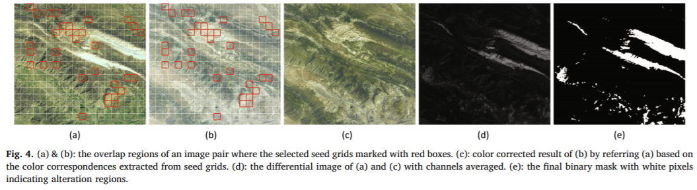

# A closed-form solution for multi-view color correction with gradient preservation
[code](https://github.com/MenghanXia/ColorConsistency)  
ISPRS 2019  

# Abstraction
image mosaicking에서 여러 장의 이미지에 일관성 색보정 작업을 하는 것은 도전적인 과제이다.  
global color optimization을 위하여, 기존의 방법은 선형 함수 또는 감마 함수와 같이 덜 유연한 보정 모델을 이용하였고, 따라서 종종 색차를 보간하는 데에 어려움을 겪었다.  
본고에서 우리는 새로운 색상 일관성 보정 방법을 소개한다. 이 방법은 parameterized spline curve를 각 이미지에 부여하는 color remapping function을 모델링한다.  
모델 표현이 유연하기 때문에, 첫째로는 본고의 방법은 매우 도전적인 과제도 수행할 수 있는 능력을 갖춘다. 즉, 다양한 색차를 가진 수백가지 이미지에도 수행할 수 있다. 둘째로, 몇몇 중요한 이미지 특성들, 예를 들면 image gradient, constrast, dynamic range 등이 모델 파라미터에 유용하게 활용될 수 있다.  
따라서, 각 이미지의 해상도를 보존하면서 색상 일관성 보정 작업을 수행할 수 있도록 오차함수를 디자인하였다.  
오차함수는 convex quadratic programming을 통해 closed form 으로 풀 수 있다.  
이에 더하여, 여러 이미지에 같은 대상물이 나타날 경우를 고려하여, 우리는 functional change detection algorithm을 제안하여 추출된 color correspondence의 정확도를 보장하고자 하였다.  
우리는 제안한 방법은 몇 가지 다양한 장르의 어려운 데이터셋에 시험해 보았으며, 우리의 방법이 이미지 품질과 평가지표 둘 모두에서 SOTA 방법을 능가함을 보였다.  

# Introduction
우리는 이미지의 시대에 살고 있다.  
인터넷의 발전으로 인한 이미지의 홍수 속에서, 이미지의 접근성이 높아지면서 이미지 처리 분야가 부상하고 있다.  

그러나 현실에서는 대부분 조광의 차이, 노출 횟수 및 카메라 response function 때문에 같은 장면이라도 일관적이지 않은 톤을 보여줄 수 있다.  
이러한 광학적 오차는 본 업무에 돌입하기 전에 보정되거나 calibrate 되어야 한다.  
그렇지 않으면 아래 사진과 같이 보기 좋지 않은 색차가 발생하게 된다.  
아래 그림은 seamless 보정을 거쳤지만 확연한 색 차이를 보여주고 있다.  

본고에서 우리는 multiview image mosaicking에 활용될 색보정 문제를 다룰 것이다.  
무엇보다 우리는 우리가 여전히 quadratic spine curve를 색보정 모델로 사용하고자 함을 명확히 한다.  
이 모델은 복잡한 색상 변환식을 표현하기에 충분히 유연하다.  
또한, 우리는 이전 연구를 두가지 방면에서 확장하고자 한다. (1) 효율성과 robustness를 높이도록 (2) gradient detail 정보를 더 많이 보존하도록  
마지막으로, global optimal solution은 convex quadratic programming을 통해 closed form으로 풀 수 있다.  

# Related Works
여러 이미지의 색상 일관성을 보정하는 방법에는 크게 두가지 기술이 존재한다.  
Color Transfer 와 Color Constitency Optimization이다.  

## Color Transfer
Gooch el ta. (2001)이 color transfer라는 개념을 처음 주장하였다.  
이는 한 이미지의 색상 특성을 다른 이미지로 전파하는 것을 목표로 한다.  
이 제안을 baseline으로 하여 많은 연구들이 수행되었다.  
초기 단계의 연구들은 각각의 컬러 채널에서 상관관계를 분리하는 것을 목표로 하였으며 content-based color transfer를 주로 수행하였다.  
지난 10년 동안 학계는 artifacts suppression과 detail preserve에 더 주목하였으며 color transfer 문제를 최적화 문제로 공식화하였다.  
Su et al(2012)는 color mapping과 detail boosting을 gradient-aware decomposition 기반으로 수행하여 좋은 결과를 얻었다.  
그러나 detail boosting 전략은 gradient enhancement 기술에 기반하므로 보존된 구조가 원래 구조와 크게 달라질 수 있다는 단점이 있다.  
color mapping을 더 정확하게 수행하기 위해 Hwang et al(2014)는 각각의 픽셀 색상을 보정하는 알고리즘을 제안하였다.  
각각의 픽셀마다 독립적인 affine model이 배정되어 color feature correspondence에 기반한 수식을 풀었다.  
그러나, 계산량에 비해 적합한 결과가 보장되지 않았다.  
이 외에도 semantic segmentation, content recognition 등의 상위 기술을 이용한 방ㅂ버이 제안되었다.  
최근 학습 기반 color transfer 방법이 제안되었으며 훌륭한 결과를 얻을 수 있었다.  
그럼에도 불구하고, color transfer 기술은 내재적으로 두 개의 이미지가 아닌 여러 장의 이미지에 적용하기에는 적합하지 않다는 단점이 존재한다.  
두 개의 이미지 쌍별로 반복적으로 수행하는 방법은 계산량이 비싸다.  

## Color Consistency Optimization
Color consistency optimization은 보통 3장 이상의 이미지의 색상 읽관성을 제고하는 것을 목표로 한다.  
또한, color transfer을 두 장의 이미지 쌍에 대하여 반복적으로 수행하는 것과 같은 stepwise 방법은 배제한다.  

.

Brown and Lowe(2007)은 global optimization을 통해 여러 이미지에 대한 gain compensation을 수행하였으며 이 기술은 파노라마 소프트웨어인 Autostitch에 내장되었다.   

지나친 노출 픽셀을 제어하기 위해 Xiong and Pulli(2010)는 선형 모델을 감마 모델로 변환하였다. 그러나 밝기 일관성이 저하되는 부작용을 보였다.  

Quan et al(2013)은 색상 비일관성을 없애기 위해 동일 대상이 나타나는 경우 획득할 수 있는 intrinsic color structure을 이용하여 manifold 기법을 제안하였다. 그러나 이는 비용이 비싸고 응용 및 픽셀 구성 등에 엄격한 제한이 있다.  

3D 모델링 분야에서, Shen et al. 이 질감 매핑에 사용되는 선형 모델 기반 색상 히스토그램 보정 기법을 제안하였다. 이 선형모델은 효율적이며 구현하기 쉬웠으나 유연성이 적어 색차가 클 경우 작동하지 않았으며, gradient 또는 contrast등의 시각 특징을 이용하지도 않았다.  

photo editing research에서, HaCohen et al(2013)이 quadratic spline을 직접적으로 이용한 remapping curve를 모델링하고 이미지 컬렉션에 대하여 일관적인 색상 style을 가지도록 최적화하였다.  
이 과정에서, non-rigid dense matching을 통해 color correspondence가 계산된다.  
이 방법은 큰 색차를 보정하기 충분히 세련된 방법이었으나, dense matching이라는 전제로 인해 컴퓨팅 비용이 너무 비쌌다.  

이 딜레마를 해결하기 위해, Park et al (2016)이 sparse feature matching 및 low-rank matrix factorization을 통한 모델 파라미터 계산을 제안하였다.  
그러나, HaCohen et al에 비하여 색보정 능력이 떨어진다는 단점이 있다.  

위 방법 중, 본고의 연구와 달리 명시적으로 색보정 과정 중에 gradient preservation 또는 contrast enhancement를 고려한 연구는 없다.  

## 문제 정의
본고의 색보정 방법에서 입력이 되는 이미지 컬렉션은 각각이 최소 1개 이상의 overlapping하는 이미지를 갖고 있어야 한다.  
즉, 모든 이미지들은 기하학적으로 상응이 되어 가까운 관계의 이미지 및 대응하는 overlap 구역이 known information으로 사용될 수 있어야 한다.  

우리의 목적은 이미지들 사이의 색차를 없애면서 기존의 detail은 살리는 것이다.  

색상 분포를 조정하기 위해, 우리는 independent color transformation을 각 입력 이미지에 적용한다.  
color transformation이라 함은 M = 6 개의 앵커포인트를 가진 monotonically increasing quadratic spine curve로 공식화된다.  
M개의 앵커포인트는 semi-free 한 2차원 점인데, 수평 좌표(x축 방향)는 고정되며 수직 좌표(y축 방향)은 자유롭게 움직일 수 있다.  
x축은 원본의 intensity value를 의미하며 앵커포인트의 수평좌표들이 고정되어 있다는 것은 원본의 intensity value 중 다룰 범위를 한정하는 것이다.  
y축은 remapped intensity value를 의미하여 모델 파라미터로서 동작한다.  

여기서 주의할 것은 remapping function이 한 채널(RGB 중 하나의 채널)만을 고려한다는 것이다.  
컬러 이미지에서, 색보정은 YCbCr 공간에서 수행되며 본고는 최적 remapping curve 여러개를 찾아 존재하는 모든 이미지들이 일정한 color 를 표현하도록 하는 것을 목표로 한다.  
마지막으로, 미분 가능한 오차 함수를 convex quadratic programming으로 풀어 학습한다.  

## 색보정 방법

본고의 접근 방법은 2단계로 이루어져 있다.  
데이터 준비 단계에서 color correspondence 및 spatial gradient statistics를 계산하고, 모델 최적화 단계에서 remapping curve를 최적화 한다.  

### Color Correspondence Extraction
Image Adjacency Topology에 따라 이미지 쌍의 겹치는 구역을 통해 correspondence를 계산한다.  
Pierre Moulon and Monasse (2013)과 비슷한 방법으로, 겹치는 구역의 color histogram을 이용하여 correspondence를 추출한다.  

구체적으로, 각 이미지 페어에 대하여 먼저 겹치는 구역의 cumulative distribution function(CDF, 즉 cumulative histogram of image values)를 계산한다.  
그 다음, 두 CDF의 corresponding equal-probability quantile을 color correspondence로 정의한다.  
이 떄, 만약 alteration object가 존재한다면 이것을 감지하고 겹치는 구역 목록에서 제외한 후 CDF를 계산하는 것이 중요하다.  
이는 이 과정이 correspondence의 정확도에 큰 영향을 끼치기 때문이다.  
Alteration Detection 알고리즘 (shin et al, 2010)은 surface resource survillance 분야에서 널리 사용되는 방법이다.  
이 알고리즘은 보통 좋은 정확도를 가지지만 컴퓨팅 비용이 비싸다.  
따라서 우리는 우리의 색보정 프레임워크에 맞는 빠른 alteration detection method를 개발하였다.  

### Model Optimization
color correspondence를 얻었으니, global optimization 방법과 solver를 설명하겠다.  
N개의 이미지에 대하여 N개의 색상 변환식을 분석할 것이다.  
우리의 접근방식으로, remapping curve는 YCbCr 공간의 Y, Cb, Cr 각 채널에 대하여 독립적으로 최적화 된다.  
각 채널에 대하여 오차함수는 w_ij가 weight이고 그 값은 두 이미지의 겹치느 ㄴ구간과 비례하게 설정될 때 

이다.  

이미지들의 color consistency를 분석하기 위하여 왜곡을 오차로 간주하는 color term을 아래와 같이 정의한다.  

