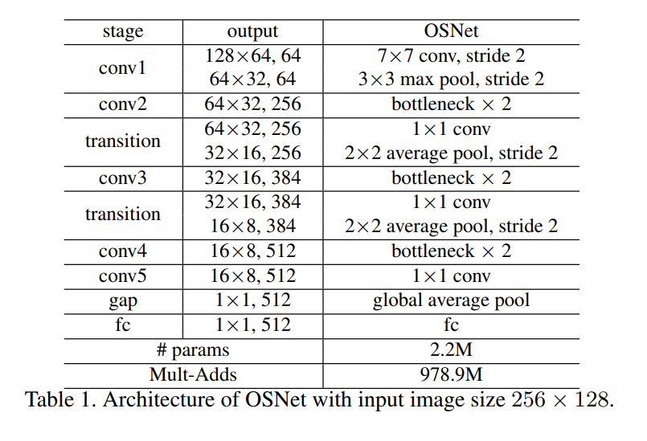

# Omni-Scale Feature Learning for Person Re-Identification
Surrey Univ. , Queen Mary Univ. of London, Samsung AI Center Cambridge  
[공식깃헙](https://github.com/KaiyangZhou/deep-person-reid)

## Abstract
개체 수준 인지 기능을 수행하기 위하여 person re-identification (ReID) 분야는 식별특징에 주목한다.  
식별 특징은 크기에 따른 특징을 의미할 수도 있지만 다양한 크기의 이미지 특징들을 임의적으로 조합한 것을 의미할수도 있다.  
본고에서는 homogeneous 및 heterogeneous scale의 특징을 통틀어 omni-scale feature라고 부르기로 한다.  
본고에서는 deep ReID CNNd인 OSNet (Omni-Scale Network)을 소개한다.  
이 네트워크는 다중 convolutional feature stream으로 이루어진 residual block을 디자인한 것에서부터 시작되었다.  
residual block은 각 scale에 맞는 feature를 탐지하며, 이후 unified aggregation gate가 input-dependent한 channel-wise weight을 이용하여 multiscale feature를 유동적으로 fuse한다.  
spatial-channel correlation을 효율적으로 학습하며 overfitting을 방지하기 위하여,  
building block은 pointwise 및 depthwise convolution을 모두 사용한다.  
이 building block을 한 층 한 층 쌓아올림으로써, OSNet은 상당한 수준의 경량화를 달성함과 동시에 현재 존재하는 ReID benchmark에서 from scratch로 훈련할 수 있게 된다.  
모델 크기가 작음에도 불구하고 OSNet은 6개의 person-ReID 데이터셋에서 SOTA 성능을 달성하였다.  

## Introduction
Person ReID는 distributed multi-camera surveillance 분야의 가장 기본적인 세부 분류이다.  
Person ReID는 서로 다른 non-overlapping 카메라 화면에서 동일인물을 매치하는 것을 목적으로 한다.    
개체 수준 인지 기능을 수행하기 위하여, person ReID는 두가지 문제를 해결해야한다.  
1. Intra-class variation : 카메라 관점에 따라 동일인물의 시각특징이 달라진다. 가장 큰 문제이다.
2. Inter-class variation : 비슷한 옷을 입은 사람들은 멀리서 보면 착각하기 쉽다. 이것은 비교적 사소한 문제이다.   

이를 해결하기 위한 가장 핵심적인 접근법은 discriminative feature를 배우는 것이다.  

본고에서는 이 feature들이 omni-scale, 즉 가변적인 homogeneous scales 및 heterogeneous scales의 조합이어야한다고 주장하는 바이다.  
omni-scale feature가 필요한 이유는 위 challenge 사진에서 보이듯이 명확하다.  

우선, 신발, 안경과 같이 작은 크기의 feature부터 전체 신체 사진까지 모든 크기의 특징이 동일하게 중요하다.  
이에 더해, (d)번을 보면 가변적인 homogeneous scale만으로는 부족한 것을 알 수 있다.  
다양한 크기에 걸친 더 복잡하고 풍부한 feature가 필요하다.  
왜냐하면, (d)에서 imposter를 색출하기 위해서는 티셔츠의 로고까지 확인해야하기 때문이다. 참고로 logo는 그 자체로는 discriminative 하지 않다.  
T-shirt라는 전제가 없다면, 다른 객체와 혼동되기 쉽기 때문이다. (예를들어 티셔츠 속의 개구리 로고와 티셔츠 위의 개구리는 다르게 인식되어야 한다.)  

최근 많은 연구에서 CNN을 차용하여 ReID 모델을 개발하였다.  
그러나, 대부분의 CNN 구조는 Resnet을 차용하는데, 이 Resnet은 본래 object category수준의 인지 업무를 위해 학습되는 구조이기 때문에 개체 레벨 인식이 필요한 ReID 업무와는 기본적으로 다른 성격을 띠고 있다.  
개체 레벨 인식으로 위해서는, omni-scale feature가 훨씬 중요하다.  
multi scale feature를 학습하기 위한 시도도 앞서 있었으나, 지금까지 누구도 homogeneous 및 heterogeneous scale feature를 학습한 시도는 없었다.  

OSNet의 기본 building block은 서로 다른 임력필드를 가진 multiple convolutional feature stream으로 구성된다.  
각 stream이 담당할 feature scale은 exponent하게 결정된다.  
exponent란 즉슨 각 블록에 다양한 scale이 고르게 분포되도록 선형으로 증가하는 새로운 차원 factor를 말한다.  
*The feature scale that each stream focuses on is etermined by exponent, a new dimension factor that is linearly increased across streams to ensure that various scales are captured in each block.*  

중요한 것은 결과물로 나온 multi-scale feature map이 channel-wise weights를 통하여 unified aggregation gate(AG)에서 dynamically fuse된다는 것이다.  

AG는 모든 stream에서 파라미터를 공유하는 sub-network로 효율적인 모델 학습을 위한 속성을 갖고 있다.  
trainable AG를 이용하면, 생성된 channel-wise weight가 input-dependent해지므로 dynamic fusion이 가능해지는 것이다.  
이 새로운 AG 디자인을 통해 OSNet이 omni-scale featrue representation을 배울 수 있게 된다.  

특정 인풋 이미지에 따라, AG는 한 scale 또는 stream에 대부분의 가중치를 배당함으로써 single scale에 집중할 수 있게 한다.  
반대로, 여러 가지 scale을 고르고 mix하는 작업을 하여 heterogeneous scale을 생산할 수도 있다.  

한편, OSNet의 또 다른 핵심 디자인 원칙은 바로 **모델이 가벼울 것**이다. 이유는,  
1. 보통 ReID 데이터셋은 다양한 카메라 시점의 동일인물 이미지를 수집해야하는 난이도 때문에 용량이 크지 않으며, 따라서 모델 크기가 작을 수록 overfitting에 덜 민감하기 때문이다. 
2. large-scale 감시감독 응용프로그램에서 ReID를 가장 실용적으로 적용하는 방법이 camera end에서 feature extraction을 수행하는 것이기 때문이다. (즉, central server로 raw video를 보내지 않고 카메라단에서 feature extraction 수행하여 feature만 전송)  
이 원칙을 지키기 위하여 pointwise and depthwise convolution으로 기존 convolution의 내부 구조를 바꾸었다.  

이러한 이유로 OSNet은 기존의 ResNet-50-based CNN 모델들보다 가벼우면서도 성능은 좋다.  
또한 본고에서 우리는 OSNet이 object category recognition task와 multi-label person attribute recognition task에서도 우수함을 보였다.  
이를 통해 omni-scale feature learning이 개체 인식 뿐만 아니라 더 확장성 있는 분야에서도 고려될 수 있음을 보였다.  
 

 ## 3 Omni-Scale Feature Learning
 먼저 우리가 내부 구조를 변경한 Convolution layer를 설명하고 Omni-scale Residual Block과 Unified aggregation gate을 설명하겠다.  

### 3-1. Depthwise Separable Convolutions
파라미터 수를 줄이기 위해, depth-wise separable convolutions를 차용하였다.  
기본적인 아이디어는 colvolution layer의 ReLU의 커널을 depthwise 커널과 pointwise 커널 두 레이어로 나누는 것이다.  
우리의 구현에서는 pointwise와 depthwise의 순서를 바꾸어 더 효율적으로 계산되도록 변경하였다.  
앞으로 이러한 Convolution Layer를 Lite 3X3이라고 부르겠다.  

### 3-2. Omni-Scale Residual Block
아키텍쳐의 기본 building block은 residual bottleneck으로, 여기에 Lite 3X3 layer가 포함된다.  
기존 residual bottleneck을 개선한 Multi-Scale bottleneck을 살펴보면, Light3X3을 여러 스택으로 쌓아 새로운 차원인 exponent t 부여하였다.  
t는 각 stream의 feature scale과 동일하다.  
즉, 인식 범위가 (2t+1)(2t+1)사이즈의 인식 범위임.  
논문은 T=4 즉 9X9 크기까지 인식하도록 설정되어있다.  

또한  

Shortcut 을 설정하여 작은 스케일 피쳐도 다음 레이어에 효율적으로 전달될 수 있다.   
따라서 Output인 Final Feature는 모든 범위의 spatial scale 정보를 담고 있게 된다.  

한편, 각 Light3X3 stream은 scale homogeneous.  
이 homogeneous feature를 합쳐 heterogeneous feature를 만드는 것이 Unified ggregation Gate이다.  
AG의 파라미터는 모든 stream이 공유한다.  
학습 이미지와 테스트 이미지에 존재하는 사람의 크기 등이 다를 수 있기 때문에 adaptive 즉 input-dependant fusion으로 디자인했다고 한다.

### 3-3 Network Architecture
단순히 앞서 말한 lightweight bottleneck layer를 layer-by-layer로 쌓았으며 각 stage별로 따로 커스터마이즈한 것은 없다.  
*OSNet is constructed by simply stacking the proposed lightweight bottleneck layer-by-layer without any effort to customise the blocks at different depths (stages) of the network.*

### 4. Experiments
평가지표 : CMC Rank-1, mAP
평가데이터셋 : Market1501, CUHK03, Duke, MSMT17, VIPeR* , GRID*  
\* 표시는 어려운 데이터셋

