# Lightweight Multi-View 3D Pose Estimation through Camera-Disentangled Representation
Facebook Reality Labs

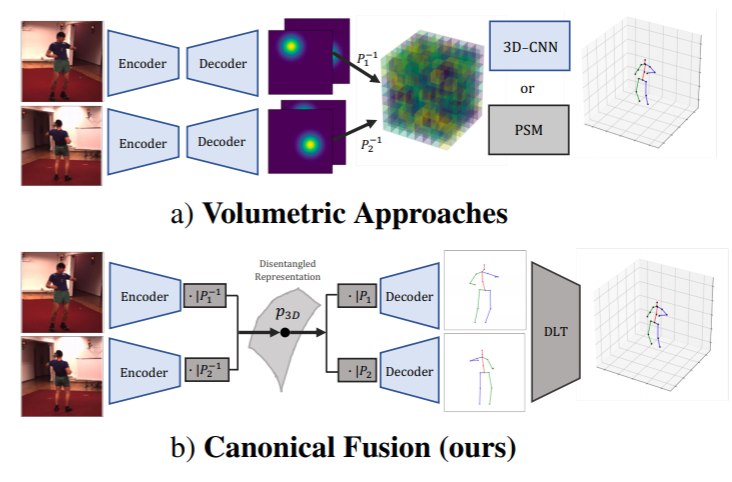

## Abstract
3D Multiview HPE를 위한 경량 솔루션을 제안한다.  
공간 보정 카메라로 찍힌 이미지를 대상으로 한다.  
interpretable representation learning의 발전에 힘입어, 우리는 3D 기하학을 이용하여 인풋 이미지들을 unified latent representation of pose로 결합하며, 이는 camera view-point로부터 disentangled된다.  
이는 우리로 하여금 각기 다른 view로부터 도출되는 3D pose를 컴퓨팅 비용이 비싼 volumetric grid 없이도 reason 할 수 있도록 해준다.  
우리의 아키텍처는 그 다음 학습한 카메라 프로젝션 표현을 제한하여 정확한 per-view 2d detection을 산출하고, 이는 간단한 미분 가능한 Direct Linear Transform 레이어를 거치면 3D로 복구할 수 있다.  
이를 효율적으로 수행하기 위해, 우리는 GPU 셋업에서 기존의 SVD 기반 삼각측량 방법 대신 사용할 수 있는 새로운 DLT 구현을 제안한다. 이 방법은 기존 방법보다 수백배 이상 차이날 수 있다.  
우리는 우리의 접근방법을 두 가지 대용량 HPE dataset (H36M, Total Capture)에 대하여 수행하였으며 SOTA volumetric 방법들을 능가하거나 비견되는 실시간 성능을 보였다.  

## Introduction
최근의 3D HPE 연구는 단일 카메라 환경에 집중하였다.  
여러 대의 카메라 환경이 계산하기는 더 쉽지만, 환경을 구성하기 어렵기 때문이다.  
그러나 최근 여러 대의 카메라를 장착한 가상현실, 증강현실 기기들이 등장하면서 multi-view 연구가 다시 전면에 등장하였다.  
그러나 multi-view 접근 방식은 해당하는 low-compute 기기에 맞는 경량화 단계를 거쳐야 할 것이다.  

아쉽게도, SOTA multiview 3d HPE 연구는 volumetric grids, volumetric Pictorial Structures, 또는 Epipolar geometry로 얻은 feature combining을 전제로 하는 DNN 구조를 차용하기 때문에 컴퓨팅 비용이 비싸다.  

본고에서 우리는 3D grid를 이용하는 비용이 필요하지 않음을 보인다.  
우리는 각각의 이미지를 latent representation으로 encode한 후, feature transform layers를 이용하여 camera transformation을 수행하면서 생기는 제약조건으로 이미지 좌표를 월드 좌표로 변환한다.  

이 과정에서 카메라 위치와 disentangled 된 참조 canonial frame을 기반으로 하는 feature map이 생산된다.  
이 피쳐맵을 1D conv로 unified latent representation, P3D로 변환하며 이것으로 각 카메라뷰에서 도출된 2D pose를 동시에 reason 할 수 있다.  
그 다음 이 latent 좌표를 known camera transformation에 제한하여 얕은 2D CNN으로 이미지 좌표로 재계산한다.  
위와 같은 피쳐 융합 기술을 Canonial Fusion이라고 부를 것이며, 이는 2D 디텍션 성능을 너무 높인 나머지 우리가 제안할 간단한 Direct Linear Transform 방법만으로도 3D 리프팅을 진행할 수 있다.  
Shifted Iteration 방법에 기반한 DLT를 새로 제안한 이유는 기존의 DLT 구현은 SVD에 의존하므로 GPU에서 효율적이지 않기 때문이다.  

간단히 말해서, 우리의 기여는 (1) 잠재 공간의 3D 기하학을 이용한 multi-camera fusion 기술로 2D detector의 결과를 reason하고 성능을 높인 것, (2) 기존 방법보다 수백배 빠른 새로운 GPU 친화적 DLT 구현을 제안한 것이다.  

## 방법
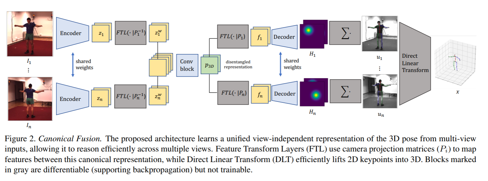

우리의 방법은 n개의 공간 보정 및 동기화 된 카메라가 장면 내의 한 사람을 찍고 있다고 가정한다.(역주 : 즉 캘리브레이션 된, 파라미터가 모두 확보된 카메라들)  
이미지셋을 I, projection matrix를 P라고 할 때 우리의 목표는 절대 월드 좌표계의 3D 자세 좌표를 한정된 관절 개수만큼 추정하는 것이다.  
추정된 3D 자세 좌표를 x_joint라고 명명한다.  

위 그림의 입력 이미지를 보면, 비록 장면이 다르지만 두 이미지는 perspective preojection부터 view-dependent occlusion까지 같은 3D 자세 정보를 공유한다.  
이 관찰로부터 우리는 우리의 아키텍처를 unified view-independent representation of 3D pose를 학습하도록 구성하였다.  
이로 인해 occlusion을 효과적으로 reason하여 정확한 2D 좌표를 산출하고, 그러면 간단히 삼각측량의 mean 값을 이용하여 3D 절대 좌표로 계산할 수 있다.  

아래에서 먼저 baseline methods를 설명하고 우리의 접근방식 및 훈련 과정을 자세히 설명하겠다.  

### 자세 추정을 위한 멀티뷰 경량 모델

각 이미지 입력에 대하여 CNN backbone e를 이용하여 feature z를 출력한다.  

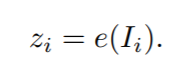

이 떄 feature map z는 카메라 뷰포인트에 fully entangled 된 3D 포즈 정보를 담고 있다.  
먼저 (1)3d pose detection of closely interactive humans using multiview cameras, (2)Deepfly3d: A deep learning-based approach for 3d limb and appendage tracking in tethered, adult drosophila 와 비슷한 baseline 접근방식을 제안한다.  
여기서 우리는 feature map z를 2D detection으로 간단히 decode한 뒤, 2D detection을 삼각측량법을 이용해 3D로 복구한다.  
이것을 Baseline으로 한다.  
효율적이긴 하지만, 이 방법은 각 카메라 뷰가 독립적으로 처리되고 self-occlusion을 해결하지 못한다.  

각 뷰를 동시에 reason하기 위한 직관적인 방법은 학습 신경망을 활용하여 모든 z에 대하여 정보를 공유하도록 하는 것이다.  
모든 뷰의 feature map을 concatenate하고 CNN에 통과시켜 view-dependent하지만 모든 뷰의 정보를 공유하는 피쳐를 만든다.  
이 방법을 Fusion이라고 부를 것이다.  
컴퓨팅 비용이 합리적이지만 이 방법은 (1) 카메라 정보를 이용하지 않고 데이터셋의 환경 설정 및 공간 정보 자체를 학습하며 (2) 다른 카메라 세팅에 적응할 수 없는 구조이기 떄문이다.  

### view-independent 표현 학습하기

앞서 말한 한계를 극복하기 위해, feature map z에 담긴 3D 정보가 모든 camera projective transform과 occlusion에 대하여 같다는 점을 이용하여 모든 뷰를 jointly reason하는 방법을 제안한다.  
우리는 이를 Canonial Fusion 방법이라고 부른다.  
이 목적을 달성하기 위해, feature transformation layer를 사용하며, 이 레이어는 원래 목표 변환식의 latent embedding을 제한하여 interpretable representation을 배우기 위해 제안된 연구에서 나왔다.  
내부적으로 FTL은 학습가능한 파라미터가 없으며 컴퓨팅 비용이 합리적이다.  
이것은 입력된 피쳐맵을 간단히 reshape하여 point-set으로 만들고, target transformation을 적용하고 그 다음 point-set을 다시 원래 모양으로 reshape 한다.  
이 기술은 학습된 latent feature space가 transformation의 구조를 보존하도록 하여, 실제로는 learned representation과 transformation 사이에 desentanglement를 발생시킨다.  
FTL이 궁금한 분들은 본고의 Supplementary Section을 참고하시라.  

앞서 몇몇 연구들이 이미지나 포즈의 한 뷰에서 다른 뷰로의 latent representation mapping을 위한 FTL 접근 방식을 사용하였다.  
본고에서 우리는 FTL을 이용하여 여러 이미지를 하나의 unified latent representation으로 매핑하려 한다.  
특히 우리는 FTL을 이용하여 feature map z 세트를 camera projection matric P로 명시적으로 제한하여 공통된 canonial represenation에 매핑할 것이다.  

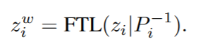

이제 feature map이 같은 canonial representation으로 매핑되었으니, 이를 concatenate한 후 1D CNN에 통과시켜 unified representation으로 fuse한다.  

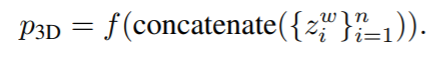

이제 학습한 shared P3D 좌표를 다시 view-specific representation f로 변환하면서 camera view-point로부터 disentangle한다.  

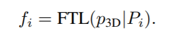

Fusion 방법과 달리 Canonial Fusion은 카메라 projection operator를 명시적으로 사용하여 각 view를 jointly reasoning하는 과정을 간소화하였다.  
CNN 블록은 따라서 멀티 카메라 세팅의 기하학적 disposition이 아니라 occlusion reasoning에만 집중할 수 있게 된다.  
또한, 이로 인해 다른 카메라 환경에 유연하게 적응하고, 학습하지 않은 뷰포인트에 대하여도 일반화 능력을 보인다.  

### latent code를 2D 좌표로 decode하기
본고의 아키텍처 중 이 컴포넌트에서는 단일 이미지 자세 추정 모델을 이용하여 각 뷰의 2D 결과 f 를 얕은 CNN 디코더 d에 거쳐 히트맵 H를 구한다. 즉, 

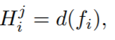

마지막으로, joint j에 대한 2D 좌표 u_j를 구하기 위해 모든 공간 좌표축의 히트맵을 합쳐 계산한다.   

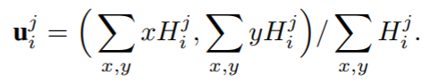

이 떄 이 과정은 히트맵 H에 대하여 미분가능하여 backpropagation을 수행할 수 있다.  
다음 섹션에서, 2D 좌표를 어떻게 3D로 복구하였는지 자세히 설명한다.  

### Efficient Direct Linear Transformation
여기서 우리의 목적은 관절 j에 대하여 여러 개의 2D 좌표를 가지고 3D point 좌표 x의 x, y, z 좌표를 구하는 것이다.  
수식이 너무 복잡하니 관절 j는 표시하지 않기로 한다.  

핀홀 카메라 모델을 전제로 하면, 우리는 알 수 없는 scale factor d에 대하여  
```
du = Px
```
라는 것을 알 수 있다.  
2d 좌표와 3d 좌표를 같은 좌표로 잘못 표현하였지만, 정확히 표현하면

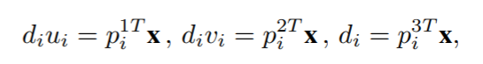

로 표현되며 p_kT는 P(projection matrix)의 k번째 행을 가리킨다.  
위의 세번째 수식을 사용하여 앞 두 수식을 풀면,  

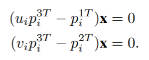

이다. 마지막으로, 모든 n 뷰에 대하여 위 두개 수식을 풀어 총 2n개의 선형 방정식을 x에 대하여 풀기 위하여 간단히 

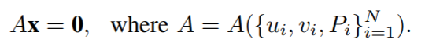

로 표현할 수 있다.  
이 떄 A는 DLT 행렬이다.  
이 방정식은 x를 scale factor에 대하여 정의하며, 우리는 non-zero solution을 찾는다.  
noise가 없을 때 위 수식은 하나의 non-trivial solution을 보장하며, 이는 2D 좌표 u를 3D 공간에 역투사 하였을 때 intersectio에 상응한다. (A는 full rank가 아니다.)  
그러나, 신경망 등에 의해 추정된 noisy한 2D 좌표의 경우 위 수식으로 문제를 풀 수 없다.  
DLT 구현에 대한 한 연구에 따르면, 위 수식은 아래와 같은 완화된 방정식으로 최적화할 수 있다.  

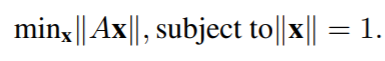

분명히 위 최적화 문제의 정답은 A_T*A의 eigenvector 및 그와 관련된 eigenvalue 최솟값 randa_min(A_t*A)이다.  
현업에서 eigenvector는 SVD(Singular Value Decomposition)의 mean 값으로 구한다.  
우리는 이 접근방식이 단지 A_T*A의 여러 eigenvector 중 하나만 구한다는 점에서 최적이 아니라고 주장하는 바이다.  
위에서 eigenvalue 최소값이 noisy하지 않은 좌표에 대하여 zero라는 점에 영감을 받아, 우리는 가우시안 노이즈를 전제로 하여 A_T*A의 최소 eigenvalue에 대한 한계선을 도출하였다.  
그 증명 과정을 Supplementary Section에 기록하였다.  

### 오차함수
이 섹션에서 우리가 어떻게 모델을 훈련하였는지 설명한다.  
우리가 제안한 DLT 구현이 2D 좌표 u에 대하여 미분가능하기 때문에, 3d 좌표 x와 관련된 gradient가 입력 이미지 I까지 흘러가며 end-to-end 훈련이 가능하다.  
그러나, 실제로, 초반 훈련을 더 안정적으로 만들기 위해서는 2D MPJPE 최소화를 먼저 훈련하는 것이 도움이 된다는 것을 발견하였다.  

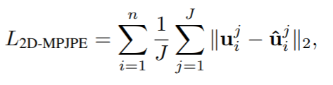

실험에서 우리는 위 오차함수에 따라 20 epoch 동안 모델을 사전훈련하였다.  
그다음, 아래 3D MPJPE 오차함수에 따라 모델을 finetune 하였다.  

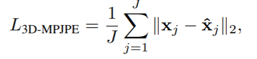

## 실험 과정
우리는 TotalCapture와 Human3.6M 두가지 대용량 데이터셋에 대하여 evaluation을 진행하였다.  

먼저 정답값의 bounding box를 이용하여 입력 이미지를 등장인물 근방으로 crop 하였다.  
크롭된 이미지를 undistort하고, resample하여 vircual camera가 crop된 이미지의 중심을 조준하도록 하고 256 * 256으로 정규화하였다.  
+-30도로 이미지를 회전하여 data augmentation을 수행하였다. (이미지 로테이션은 카메라 로테이션의 z 축에 해당한다.)  
그리고 standart color augmentation 또한 수행하였다.  

실험에서 사용한 backbone 인코더는 ResNet152이며 ImageNet에 대하여 사전훈련되었다.  
fusion block은 두개의 1d CNN이다.  
디코더는 4개의 transposed CNN 및 히트맵을 계산하는 1d CNN이다.  
더 자세한 구조는 Supplementary Section을 참고할 수 있다.  

50 epoch동안 SGD optimizer로 lr은 2.5 * 10^-2 이다.  

# 결론

우리는 3D HPE의 새로운 fusion 기술을 소개하였다.  

