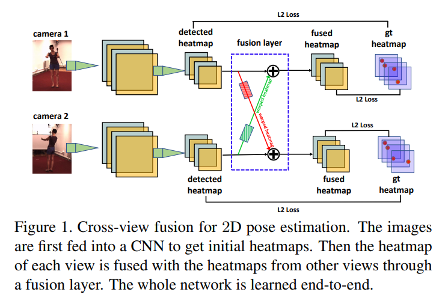
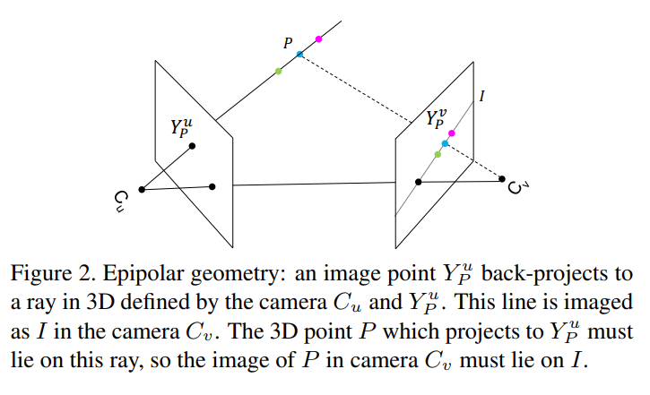
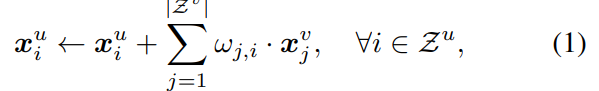
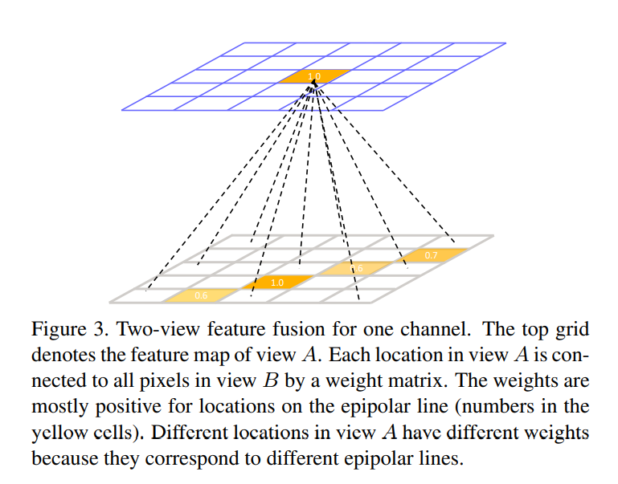
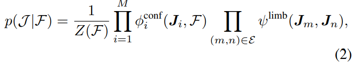
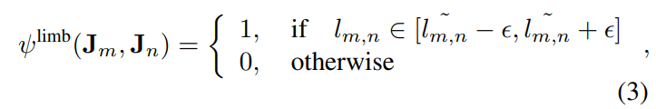
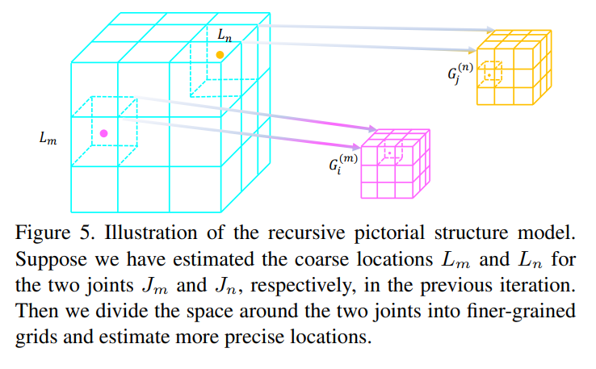
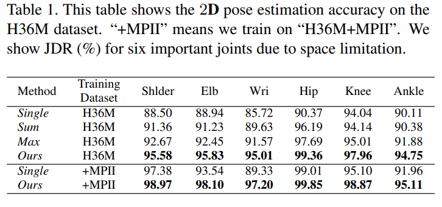
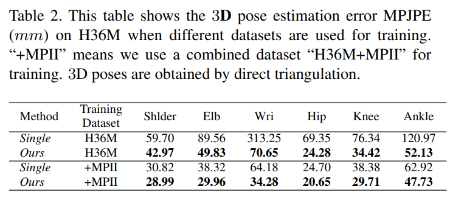
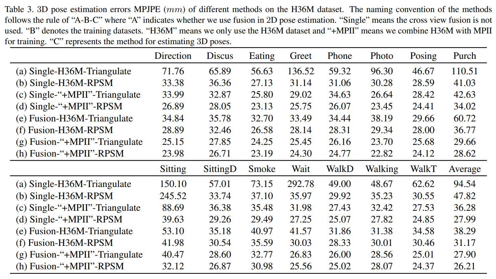

# Cross View Fusion for 3D Human Pose Estimation
[official codebase](https://github.com/microsoft/multiview-human-pose-estimation-pytorch)

## Abstract
우리는 다시점 이미지로부터 multi-view geometric priors를 모델 내부에서 합치는 방식으로 3D 인체 자세 절대값을 복원하는 접근방식을 소개하고자 한다.
이 방식은 two-step approach이다.
1. 다시점 이미지로부터 2D 자세를 추정한다.
2. 다시점 2D 자세들로부터 3D 자세를 복원한다.

1번의 경우 먼저, CNN 내부에 cross-view fusion 기법을 도입하여 다시점 2D 자세들을 동시에 추정한다. 이로인해 2D 자세의 각 시점은 다른 시점의 정보를 이용하여 정확도를 향상할 수 있다.

2번의 경우, recursive Pictorial Structure Model을 이용하여 다시점 2D 자세로부터 3D 자세를 복원한다. 이를 통해 감당 가능한 컴퓨팅 비용으로 3D 자세의 정확도를 점진적으로 증가시킬 수 있다. 

MPJPE는 Human36m 데이터셋에서 26mm, Total Capture 데이터셋에서 29mm로 각각 SOTA를 뛰어 넘었다.(52 -> 26, 35 -> 29)

## Introduction
그 동안의 연구들은 단일 이미지로부터 "상대적인" 3D 자세를 추정하는 데에 많은 노력을 기울였으며, 대체로 골반 부위를 중심으로 정렬되었으므로 실제 환경(월드 좌표계)에서의 "절대적인" 위치를 알기가 어렵다. 

본고에서 우리는 다시점 카메라로부터 월드 좌표계상 절대적인 3D 자세를 찾는 문제를 해결하고자 한다.  
많은 two-step approach의 문제점은 3D 자세를 복원하는 두번째 단계가 2D 자세를 추정하는 첫번째 단계의 정확도에 따라 성능이 달라진다는 데에 있다. 예를 들어, 가림 문제 등으로 인해 첫 번째 단계에서 2D 자세 측정이 잘못되면 3D 자세 측정 성능도 영향을 받을 수 밖에 없다.

이 때 Pictorial Structure Model(PSM)을 3D 자세 추정에 사용하면 부정확한 2D 관절 좌표의 공간 의존도를 고려하여 해당 좌표의 영향력을 낮출 수 있다.  
PSM은 root joint(base joint, 보통 골반) 주변의 공간을 N * N * N 그리드로 이산화 한 후, 각 관절을 N^3개의 bin 중 하나로 배정(예측)한다.  
PSM은 추정된 3D 자세와 2D 자세의 projection error, 그리고 좌표들의 공간상 배치와 사전 확률 구조 간 이격을 동시에 최소화한다.  

그러나, 공간을 이산화 하는 작업은 큰 quantization error를 발생시킨다.  
예를들어 사람 주위의 공간이 2000mm이고 N = 32이면, 최대 30mm의 quantization error가 발생한다.  
이는 N의 크기를 늘리면 해결되지만 계산복잡도가 O(N^6)이기 때문에 한계가 있다.  

본고에서는 위와 같은 문제점을 해결하기 위해 아래 두 가지 해결방법을 제시한다.

첫째, CNN 기반 접근방식으로 다시점 2D 자세를 동시에 추정하며 2D 자세 자체의 정확도를 개선한다.  
이 방법을 사용하면 2D 히트맵 퓨전 과정에서 다른 시점 간 상응하는 위치를 찾는 문제도 자연스럽게 해결된다.  
위 방법의 구현은 아래와 같은 구조의 fusion neural network를 이용하여 이루어진다.  

둘째, Recursive pictorial Structure Model을 이용하여 추정한 다시점 2D 히트맵으로부터 3D 자세를 복원한다.  
quantization error를 해결하기 위해서 공간을 한 번에 많은 수의 bin으로 이산화해야 하는 기존 PSM 방법과 달리, RPSM은 (이전 step에서 추정한) 각 좌표 위치 주변의 공간을 반복적으로 더 잘게 이산화하기 때문에, 결과적으로 각 step마다 3D 자세의 정확도가 점차 높아진다.  

각 step의 이산화 기준인 N은 보통 작은 수로 설정하기 때문에 한 번 순회 하는데에 드는 추론 속도가 매우 빠르다.  
본고의 실험 결과 RPSM 방식은 기존 PSM 방식보다 추론 시간은 약간 증가한 반면 오차는 최소 50%가량 감소하였다.  

H36M 데이터셋에 대한 2D 자세 추정에서, 모든 관절 좌표에 대한 정확도를 89%에서 96%로 개선하였다.  
또한, 가장 어려운 관절 좌표 중 하나인 손목 좌표의 정확도 개선이 눈에 띈다.  

H36M 데이터셋에 대한 3D 자세 추정에서, PSM을 RPSM으로 바꾸면서 평균 오차는 77mm에서 26mm로 낮아졌다.  
평균 오차가 52mm인 현 SOTA 방법과 비교하더라도, 반 이상 적은 오차를 달성하였다.  
또한 Total Capture 데이터셋에 일반화 가능성 입증을 위하여 evaluation을 수행하였으며, 이 또한 SOTA를 능가하였다.  

## 관련 연구

먼저 다시점 3D 자세 추정에 관한 연구를 살펴보고 그것이 어떻게 본고와 다른지 설명하겠다.  
그 다음 feature fusion 기법에 대한 논의를 진행하겠다.  

### 다시점 3D 자세 추정
다시점 자세 추정에 관한 많은 연구들이 있다.  
보통 위 연구들은 우선 인체 모델을 단순한 기초 요소로 표현되도록 정의한 뒤, 투영한 인체 모델을 이미지 특징에 맞추어 모델 파라미터를 최적화하는 방식으로 접근한다.  
이 때 어떤 이미지 특징을 사용했느냐와 어떤 최적화 알고리즘을 사용했느냐에 따라 연구 의의가 달라진다.  

본고는 object detection 분야에서 object parts 사이의 공간의존도를 모델링하기 위해 널리 사용되는 PSM 방식에 주안점을 두었으며, PSM은 object parts를 신체부위로 상정하여 2D 및 3D 자세 추정에서도 사용된 바가 있다.  

Amin et al.은 다시점 환경에서 PSM을 이용하여 2D 자세를 추정한 후 직접 삼각 측량으로 3D 자세를 얻었다.  

이후 Burenius et al.과 Pavlakos et a.이 PSM을 확장하여 다시점 3D 자세 추정에 응용하였다. 예를 들어, 각 시점에서 독립적으로 2D 자세를 추정한 후 PSM을 이용하여 3D 자세를 복원하였다.  

우리의 연구가 위 연구와 다른 점은 우리의 연구는 PSM을 RPSM으로 확장하여, 3D 자세를 효율적으로 반복 정제하도록 하였다는 것이다.  
또한 위 연구는 2D 자세 추정에서 cross-view feature fusion도 이용하지 않았다.   

### 다중이미지 특징 융합
서로 다른 소스로부터 특징을 융합하는 것은 컴퓨터 비젼 학계에서 널리 알려진 관행이다.  

예를 들면, Zhu et al.은 물체를 더 안정적으로 감지하게 위해 비디오에서 인접한 프레인의 특징을 광학 흐름에 따라 현재 프레임으로 가져왔다(fusion).  

Ding et al. 은 multi-scale 특징을 집약(fusion)하여 큰 물체와 작은 물체 모두의 세그맨테이션 정확도를 개선하고자 하였다.  

Amin et al.은 다시점 이미지들 사이의 기하학적 관계를 탐색하며 2D 자세를 추정하고자 하였다.  

위 연구와 본고가 다른 점은 더 나은 2D 히트맵을 얻기 위해 특징을 융합하지는 않았다는 점이다. 대신, 그들은 다시점 3차원 기하 관계식을 사용하여 "불완전한" 2D 히트맵들 중 하나의 관절 위치를 "선택"하였다.  

또 다른 연구에서는 multi-view consistency를 supervision source로 이용하여 자세 추정 네트워크를 훈련하였다.  

본 연구진이 아는 바로, 서로 다른 시점 사이에서 상응하는 특징을 찾는 것이 쉽지 않기 때문에 다시점 특징을 융합하여 더 나은 2D 자세 히트맵을 얻고자 하는 연구는 이때까지 없었으며, 이것이 바로 본 연구의 핵심 기여 중 하나이다.  

### Cross View Fusion으로 2D 자세 추정하기
본고의 2D 자세 추정은 다시점 이미지들을 입력으로 받아, 각각의 이미지에 대한 자세 히트맵 초기값을 생성하고, 그 히트맵들을 서로 다른 시점에 대하여 융합하여 각각의 시점이 다른 시점 정보를 이용할 수 있도록 하였다.  

이 과정은 하나의 CNN으로 종단간 미분가능하도록 구현할 수 있다.  
아래 그림은 2-view fusion을 도식화 한 것이다.  

2-view fusion이 해결되면 multi-view로 확장하는 것은 trivial 한 문제이다.  
본고의 fusion approach의 핵심은 두 개의 서로 다른 시점 사이에 서로 상응하는 특징을 찾아내는 것이다.  

3D 공간 상에 좌표 P가 있다고 가정하자.  
아래 그림을 보면, 

이 때, 좌표 P를 view u와 view v에 투영한 2차원 좌표인 Y_u와 Y_v는 각각 view_u 및 view_v의 전체 픽셀 위치 중 한 원소이다.  
히트맵 F)u와 F_v는 각각 view_u와 view_v의 모든 2차원 좌표에 해당하는 heat 값의 집합이다.  
특징 융합의 핵심 아이디어는 view_u에서 히트맵 F_u의 한 점 x_i가, 히트맵 F_v의 특징들과 융합할 때, 다음과 같은 관계가 성립한다는 것이다.  

여기서 w_j,i는 결정된 스칼라값이다.  
이상적으로, 각 i에 대하여 단 하나의 w_j,i만이 positive하며, 나머지는 모두 zero이다.  
w_j,i는 view_u 안의 픽셀 i와 view_j안의 픽셀 j가 같은 3D 좌표에 대응할 때 positive이다.  

만약 우리가 Y_u만 알고 있다고 가정한다면, 다른 시점의 Y_v를 어떻게 찾을 수 있을까?  
우선 우리는 Y_v가 epipolar line I 위에 있음이 보장됨을 알고 있다.  
그러나 P의 깊이(z 값)를 모르므로, C_u와 Y_u로 결정되는 I 선분 위의 어느 점이 Y_v인지 모른다.  
이것이 cross view fusion의 난점을 초래한다.  

우리는 그에 대한 해결책으로 x_u를 선분 I 위의 모든 특징과 융합할 것을 제안한다.  
이는 자칫 무식한 방법으로 들릴 수 있지만, 사실 매우 우아한 방법이다.  

이유는 특징 융합이 히트맵에서 발생하기 때문에, 이상적으로는 x_v가 Y_v(찾고자 하는 좌표)에서 큰 응답을 가져야 하고, epipolar line I의 다른 위치에서 0을 가지기 때문이다. 이는 선분 위에서 다른 모든 지점이 특징 융합에 미치는 영향이 없거나 매우 적다는 것을 의미한다. 따라서 epipolar line 위의 모든 pixel을 융합하는 것이 간단하고 효과적인 해결책이 될 수 있다.  

#### Cross View Fusion의 구현
위 특징 융합 수식은 자세 히트맵의 각 채널에 대해 수행하는 FC layer 연산으로 치환할 수 있다. (w가 학습 파라미터)  
아래 그림이 이 아이디어를 도식화한 것이다.  

피쳐맵(히트맵)의 각 채널이라 함은 각각의 관절에 대응하며, cross view 관계식은 관절이 아닌 카메라 시점에 영향을 받으므로 각 채널(관절) 히트맵은 동일한 가중치를 가진다.  
특징 융합을 신경망 연산으로 치환함으로써 종단간 미분가능한 가중치 학습을 수행할 수 있게 된다.  

우리는 신경망 학습을 위해 두 가지 방법을 연구하였다.  

첫번째 방법에서는, 상응하는 좌표가 epipolar line 위에 있지 않은 경우 해당하는 좌표의 양의 가중치를 모두 0으로 일괄 조정하였다. 음의 가중치는 부정 관계를 표현하기 위해 허용하였다.  

두번째 방법에서는, 아무 조정을 하지 않고 네트워크가 자유롭게 학습하도록 하였다.  

위 두 방법에 대한 2D 자세 추정 결과는 비슷하였으므로, 본고에서는 더 간단한 두 번째 방법을 사용하였다.  

#### Cross View Fusion의 한계 및 제언
학습된 융합 가중치는 암묵적으로 epipolar geomatry의 정보를 인코딩하고 있으며, 카메라의 각종 설정값에 영향을 받는다.  
따라서, 특정 카메라 환경에서 촬영된 이미지로 모델을 학습한 경우 다른 환경에서 촬영한 이미지에 곧바로 적용할 수 없다는 한계점이 있다.  

새로운 데이터셋 없이도 우리의 모델을 새로운 환경에 적용할 수 있는 방법을 제안하고자 한다.  
이전 연구에 따라 semi-supervised 학습 방법을 차용한다.  
먼저, 단시점 2D 자세 추정 모델을 MPII 등 기존 데이터셋에 대하여 학습한다.   
그 다음, 훈련된 모델을 새로운 환경에서 촬영한 다시점 이미지에 적용하여 결과값을 얻는다. 이를 임시방편의 정답값으로 상정한다.  
몇몇 이미지에 대하여 결과값이 매우 부정확할 수 있으므로, multi-view consistency를 이용하여 부정확한 결과값을 걸러낼 것을 권한다.  
multiview consistency를 확인하는 방법은 이전 연구에서 소개하고 있다.  
cross view fusion 신경망을 학습할때, 걸러낸 관절값에 대하여는 supervision을 수행하지 않는다. (?)  
이 방법은 실험 섹션에서 확인해 볼 것이다.  

### RPSM 으로 다시점 3D 자세 추정
인체를 시각 모델로 나타낼 때 M개의 좌표에 대한 임의 변수 J = {J1, J2, J3, ... JM}으로 나타낼 수 있다.  
각 변수 J_i는 월드좌표계에서 각 관절의 3차원 위치를 나타내는 state vector J_i = [x_i, y_i, z_i]를 의미하며, 각 값은 이산 상태 공간에서의 값이다.  
두 변수 사이의 선분은 조건부 종속성을 나타네며, 현실세계에서의 물리적 제약조건으로 해석할 수 있다.  

#### Pictorial Structure Model
3D 자세 J와 다시점 2D 자세 히트맵 F가 주어졌을 때, 사후확률은 다음과 같다.  

Z(F)는 정규화 상수이며 E는 두 변수 사이를 잇는 선분을 나타낸다.  
단항 포텐셜 φ_conf는 이전에 추정된 다시점 2D 자세 히트맵 F를 기반으로 계산된다.  
쌍별 포텐셜 φ_limb는 관절 사이의 신체 길이 제한 정보를 인코딩한다.  

- 이산 상태 공간 : 
먼저 모든 시점에서 탐지된 2D 좌표 위치를 바탕으로 root joint(보통 골반 좌표)의 3D 좌표를 삼각측량한다.  
그러면, 3D 자세의 상태공간은 해당 root joint에 중점을 가진 3D bounding volume으로 제한할 수 있다.  
volume은 N * N * N 크기의 그리드공간 G로 이산화할 수 있다.  
모든 신체 관절은 N^3개의 이산적 위치(bin)를 가진 공통된 상태 공간 G를 공유한다.  

- 단항 포텐셜 :
모든 관절 좌표 후보, 즉 그리드 G의 한 bin 은 월드좌표계의 3D 위치으로 정의된다.   
우리는 모든 시점의 카메라 파라미터를 이용하여 구성한 픽셀 좌표계에 해당 3D 위치를 투영하여, F로부터 상응하는 joint confidence를 구할 수 있다.  
모든 카메라 뷰의 confidence 평균을 계산하여 단항 포텐셜 예측값을 계산할 수 있다. 

- 쌍별 포텐셜 : 
각 관절쌍 (J_m, J_n)는 선분집합 E에 속한다.  
트레이닝 셋의 각 관절간 평균 거리 L_m,n를 신체부위 길이의 사전확률로 계산한다.  
추론 국면에서, 쌍별 포텐셜은 아래와 같이 정의한다.  

이떄 L_m,n은 J_m과 J_n간의 거리이다.  
이 쌍별 항을 사용함으로써 3D 자세가 합리적인 신체 길이를 가지도록 할 수 있다.  
본고의 실험에서 엡실론은 150mm로 정하였다.  

- 추론 과정
마지막 단계는 이산 상태 공간에서 사후확률을 극대화 하는 것이다.  
비순환 그래프의 특성상, globally 최적이 보장된 dynamic programming으로 최적화 할 수 있다.  
계산 복잡도는 O(N^6)이다.  

#### Recursive Pictorial Structure Model
PSM 모델은 quantization error의 문제점이 있다. 예를 들어, N=32일 때 quantization error는 최대 30mm까지 나올 수 있다.  
그렇다고 N을 크게 하면, quantization error는 작아지지만 계산복잡도가 기하급수적으로 증가한다.  

따라서 큰 값의 N을 한 번에 사용하지 않고, 여러 단계를 거쳐 각 단계에서 작은 N 값으로 관절 위치를 정밀화 할 것을 제안하는 바이다.  

첫 번째 단계(t=0)에서, 3D bounding volume을 삼각측량된 root joint 주위에 N=16 정도의 느슨한 값으로 이산화 하여 PSM 방식으로 초기 3D 자세 추정값 L = (L_1, L_2, ... L_M)을 구한다. (M은 관절 갯수)

그 다음부터는(t>0), 각각의 관절 J_i에 대하여, J_i가 속한 위치 L_i를 2*2*2의 이산 공간 G_i로 이산화한다.  

이 방식의 공간 이산화는 PSM과 두가지 방면에서 다른 점이 있다.  
먼저, 서로 다른 관절점이 각각의 그리드를 가지게 되며 이는 모든 관절이 한 그리드를 공유하는 PSM과 다르다. 아래 그림을 참고하면, 각 관절점이 서로 다른 그리드를 가진다. 

둘째로, bounding volume의 모서리 길이가 단계가 지날수록 작아진다.  
이것이 그리드가 이전 단계보다 세밀해지는 이유이다.  

각각의 관절점을 독립적으로 정밀화하기보다, 서로간의 공간 관계를 고려하여 모든 관절점을 동시에 정밀화하였따.  
이미 volume의 중심점, 크기, 그리고 그리드 내 bin의 갯수를 알고 있으므로, 각 그리드의 bin의 위치를 계산하여 단항 포텐셜 및 쌍별 포텐셜을 계산할 수 있다.  
쌍별포텐셜은 이전 단계의 추정 위치에 영향을 받기 때문에 즉석에서 계산할 필요는 없다.  
그러나, N을 충분히 작은 값으로(본고의 실험에서는 2로) 설정하였으므로, 이 계산은 빠르게 수행될 수 있다.  

#### Bundle Adjustment와의 관계
Bundle Adjustment 또한 3D 구조를 정밀화 하는 데에 널리 알려진 도구이다.  
RPSM이 이것과 다른 점은 두 가지로 설명할 수 있다.  
먼저, Bundle Adjustment는 특유의 공간 탐색 방식으로 인해 서로 다른 local optimum에 도달한다.  
Bundle adjustment는 점진적 방법으로 공간을 탐색하지만 RPSM은 divide and conquer 방법으로 공간을 탐색한다.  
둘째로, 유한차분을 이용해 미분값을 계산하는 Bundle Adjustment 방식은 heatmap 내 좌표 대부분이 0 값을 갖기 때문에 안정적이지 않다.  

### 데이터셋 및 평가지표
- H36M
- Total Capture 
- 평가지표  
    2D 자세 추정 정확도는 Joint Detection Rate(JDR) 이용.  
    3D 자세 추정 정화도는 MPJPE 이용  

### 2D 자세 추정 실험 과정
#### 상세 구현
우리는 < Simple Baselines for human pose estimation and tracking >에서 제안한 모델을 기본 구조로 채택하고 ImageNet classification 데이터셋으로 사전훈련된 ResNet-152를 backbone으로 선택하였다.  
입력 이미지 크기는 320 * 320이며 히트맵 해상도는 80 * 80이다.  
히트맵을 regression 목표로 하여 모든 시점의 특징 융합 전후간 L2 loss를 학습에 이용하였다.  
30 epoch동안 학습하였으며, learning rate 및 decay 전략 등의 다른 하이퍼 파라미터는 참고한 논문을 그대로 따랐다.  
본고에서 이용한 모델보다 더 최신 모델을 사용한다면 성능 개선을 기대할 수 있을 것이다.  

#### 양적 결과 분석

위는 본고에서 실험 시 가장 중요시 여기는 관절 부위에 대한 방법론별 성능을 기록한 표이다.  

Single = Baseline. 즉 참고 논문에서 아무 수정을 하지 않았을 때이다.  
Sum 과 Max는 각각 Baseline에서 epipolar line 위의 값들을 sum 연산 하였을 때와 max 연산 하였을 때를 표시한 것이다.  

Cross view fusion을 도입한 본고의 접근방식은 모든 관절에 대하여 Single 의 성능을 능가하였으며, 특히 손목 좌표 탐지 성능 개선이 눈에 띈다.  

위는 마찬가지 조건으로 계산한 3D 자세 에러값을 표로 나타낸 것이다.  
여기서 3D 자세는 모두 기본적 삼각 측량법을 통해 계산하였으며,  
각 방법간 달라지는 것은 2D 자세 추정법 뿐이다.  

### 3D 자세 추정 실험 과정
#### 상세 구현
RPSM 초기 단계에서, root joint를 중심점으로 하는 2,000mm의 3차원 공간을 16^3개 구획으로 나눈다. 그 후, 거친 3D 자세를 수식(2)를 풀어 구한다.  
더 많은 구획으로 나누는 방법도 시도해 보았으나, 계산복잡도가 너무 커졌다.  
초기 단계 이후부터는, joint가 포함된 구획별로 2^3 구획으로 다시 나누었다.  
초기 단계보다 작은 수로 구획을 나눈 이유는 쌍별 포텐셜 계산복잡도를 낮추기 위해서이다.  
본고의 실험에서, 위 과정을 10번 반복하는 것은 0.4초 정도 걸렸다.  
초기 단계의 경우 8초 정도 소요된다.  

#### 양적 분석
8가지 다른 방법을 사용하여 각각의 성능을 분석하였다.  
이후 에러는 94.54mm에서 26.21mm까지 낮아졌다.  

- RPSM vs Triangulation :  
RPSM 방식이 삼각측량법보다 2D 자세가 불안정 할 때도 3D 에러가 적다.  
위 표를 보면, (a) 및 (b)를 비교해보면 똑같이 불안정한 2D 자세 추정기로부터 3D 자세를 추정하였음에도 RPSM이 오류가 반절 정도로 적어진다.  
이는 모든 좌표에 대한 반복적 정밀화 및 최적화 때문인 것으로 추정된다. 

- RPSM vs PSM :  
RPSM이 더 좋다.

- Single vs Fusion :  
Fusion이 Single(baseline)보다 좋다.  

- 현 SOTA와 비교 :  
cross view fusion + RPSM 이 더 좋다.   

#### 새로운 카메라 환경에 적용하기
H36M 데이터셋을 정답값 없이 실험해 보았다.  
MPII 데이터로 훈련한 단일 이미지 자세 추정(Single - Baseline) 모델로 pseudo 정답값을 생성한다.  
H36M의 테스트셋을 아무 추가 훈련 없이 모델에 통과 시키면, 109mm의 MPJPE가 나온다.  
baseline 모델을 pseudo 정답값으로 훈련한 뒤 통과시키면, 61mm로 낮아진다.  
baseline 모델이 아닌 fusion model로 훈련한 뒤 통과시키면, 43mm로 낮아진다.  

## Conclusion
본고의 첫번째 기여는 CNN 기반 다시점 특징 융합 접근 방식으로 2D 자세 추정 정확도를 크게 높였따는 것이다.  
두번째 기여는 RPSM을 도입하여 다시점 2D 자세로부터 3D 자세를 복원하는 방법을 제시했다는 것이다.  
위 두가지 기여는 서로 독립적이며 각각 다른 방법론과 함께 응용할 수 있다.  