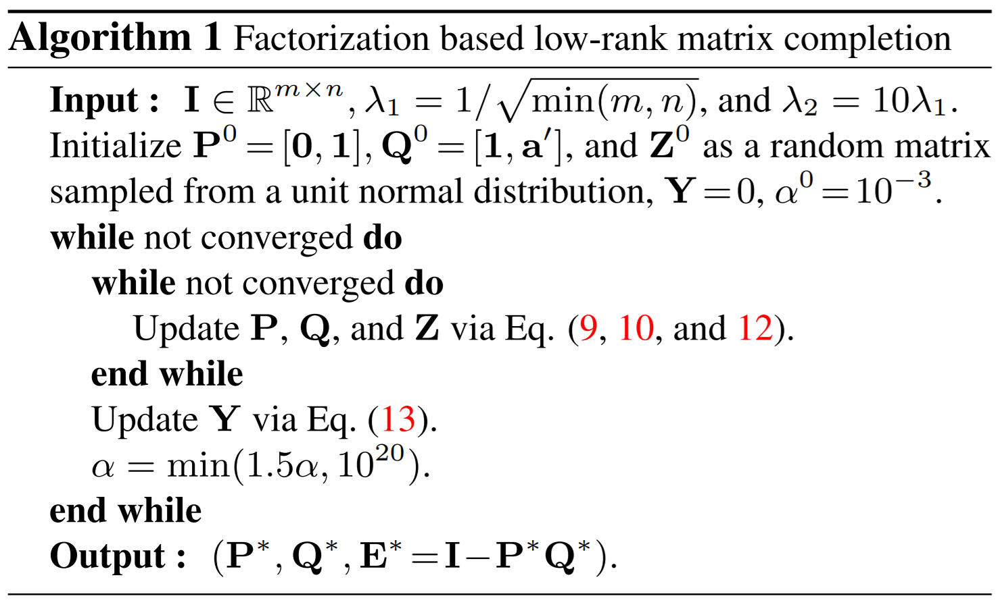
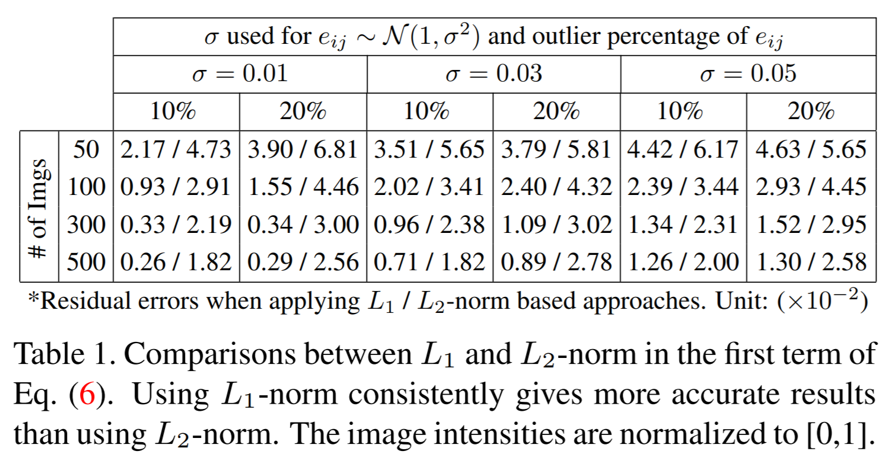
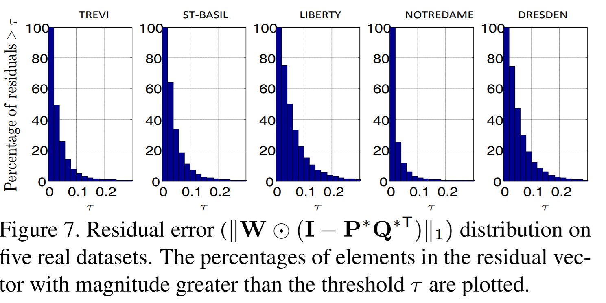

# Efficient and Robust Color Consistency for Community Photo Collections
[codebase](https://github.com/syncle/photo_consistency)  
CVPR, IEEE 2016

## Abstract
비슷한 풍경을 찍은 여러 이미지의 색상 일관성을 최적화하는 효율적인 기술을 소개한다.  
우리의 방법은 첫번째로 입력 이미지 집합의 픽셀 상관관계 정보를 담은 희소벡터를 쌓아 빈 공간이 많은 행렬로 만든다.  
우리는 이 행렬이 간단한 색보정 모델에서 rank 2 constraint를 만족함을 보였다.  
이 파라미터는 각 이미지에 대하여 간이 화이트 밸런스 및 감마 보정 파라미터로 취급할 수 있다.  
우리는 robust한 low-rank matrix factorization 방법으로 이 모델의 unknown parameter를 평가하였다.  
unknown parameter를 이용하여, 입력 이미지의 색상 일관성을 개선하거나 하나의 참조 이미지를 선정하여 색상 전이를 수행할 수 있다.  
우리의 접근방식은 픽셀 상관관계 이상값에 무관하게 작동하므로, 복잡한 전처리 절차를 밟을 필요가 없다.  
우리는 유명 여행지의 대용량 이미지 컬렉션 및 인물 이미지 컬렉션에 대하여 수행한 고품질 색상 일관성 최적화 결과를 시연하였다.  

## Introduction
최근 SNS 사용률이 증가하면서 유명 여행지 또는 인물, 사회적 행사의 이미지를 크라우드소싱하기 좋은 환경이 되었다.  
이는 가상 관광 및 네비게이션, 이미지 보완, colorization, 이미지 배경 증강 등의 응용 분야로의 발전을 이끌었다.  

이 떄, 이미지 컬렉션 내 이미지 각각의 색상 통계값은 매우 다양한 분포를 보이는데, 이는 각기 다른 조광과 촬영 시간, 또는 카메라의 response function별로 다른 비선형 처리 기법 때문이다.  

이러한 측광 불일치(photometric inconsistency)는 여러 이미지를 오버래핑하여 구분선이 명확하지 않은 이미지 배열을 구현하고자 하는 응용사례에서 시각적 흔적을 남기게 된다.  

비록 최근의 이미지 편집 툴이 몇 가지 색 보정 기능 및 톤 보정 기능을 제공하지만, 이 기술은 보통 간접적인 사용자 참여를 필요로 하거나 color balance 또는 tone curve를 직접 조정할 것을 요구한다.  
따라서, 이러한 상호작용 기술은 대용량 이미지 컬렉션에 이용하기에는 부적절하다.  
반면, 이미지 개별적으로 색보정 기술을 수행하는 것 또한 전체 이미지 컬렉션의 색상 불일치 문제를 해결하지 못한다.  

2013년 HaCohen et al.(Optimizing color consistency in photo collections)은 이미지 컬렉션 중 참조 이미지 하나를 선택하여 색상 일관성을 개선하기 위한 방법으로 다중 이미지 사이의 픽셀 상관관계 정보를 담은 밀집 행렬을 복구하는 방법을 제안하였다.  
이 방법은 계산복잡도가 높기 때문에 수천개의 이미지를 포함하는 대용량 이미지 컬렉션을 처리하는 데에는 부적절하다.  

본고에서, 우리는 새로운 matrix factorization 기반 자동 색상 일관성 최적화 방법을 소개한다.  
이 방법은 다중 이미지로부터 얻은 희소 상관관계 행렬을 이용하여 sparse local feature matching을 수행한다.
그 다음, 선택적으로 rigid scene에 대하여 structure from motion 작업을 수행한다.  
그 다음 화소 강도를 이미지 개수만큼의 차원을 가진 벡터로 배열한다.  
이 벡터를 쌓아 행렬로 만들면, 해당 행렬은 missing entry가 많은 행렬이 된다.  
이 행렬이 matrix factorization을 수행할 목표행렬이 된다.  

간단한 색보정 모델에서, 이 행렬의 행렬로그는 이상적인 상황(완벽한 상관관계, noise 없음, 일관적인 조광 상태) rank two constraint를 만족한다.  
이 rank two matrix는 두 개의 rank one matrix의 합으로 나타낼 수 있다.  
하나는 색보정 파라미터와 관련된 행렬이고 다른 하나는 희소 상관관계 행렬 성분 각각에 대응하는 장면 포인트의 반사율(albedos)와 관련된 행렬이다.  
여기서 색보정 파라미터는 간이 화이트 밸런스 및 감마 보정 파라미터로 취급할 수 있다.  
여기서 '간이'라 함은, 예측값이 정답값과 반드시 일치할 필요성이 없다는 것을 의미한다.  

우리의 접근방법은 R. Cabral et al(ICCV 2013)이 제안한, 이상값에 robust한 low-rank matrix factorization 기술에 기반한다.  
우리의 접근방법이 성공한 이유는 robustness의 영향이 가장 크다. 왜냐하면, 실제 상황에서 몇가지 요인 - 조광의 변화, 그림자, 노출값이 높은 픽셀, 피쳐 상관성 오류 등등 - 이 이상치를 만들어내어 목표 행렬의 low rank 구조를 훼손하기 때문이다.  
우리는 또한 matrix factorization 공식의 모호성을 분석하고 이를 실제적으로 해결할 방법들을 제안한다.  
low rank matrix 공식과 L1-norm 기반의 robust factorization 기술을 이용한 그 응용이 우리 연구의 가장 중요한 의의이다.  

밀집 행렬과 정확한 상관관계 행렬을 전제로하였던 이전의 이차 최적화 문제 연구와 달리, 우리의 기술은 오직 희소 상관관계만을 필요로 한다.  
게다가, 우리 방법의 기저에 있는 robustness가 이상치에 덜 민감하고 복잡한 전처리가 필요없도록 만들었다.  
우리의 접근 방식은 이전 연구보다 계산복잡도가 훨씬 효율적이며 수천이 넘는 대용량 이미지에도 적합하다.  
우리의 방식은 적은 수의 이미지에도 적용할 수 있으며, 대상의 크기, 관점, 대상의 자세 및 일그러짐에 큰 변화가 있어도 여전히 유효하며, 이는 그 동안 밀집 행렬을 이용한 솔루션이 문제를 겪었던 부분이었다.  

우리는 우리의 기술을 다양한 데이터셋에 적용하였다.  
유명 여행지의 이미지 컬렉션과 셀러브리티들에 대한 이미지 컬렉션도 포함한다.  
우리는 또한 color correction과 color transfer이 크리우드 소싱된 이미지로 수행한 image stitching, multi-view stereo, image-based rendering 작업의 성능도 높였음을 보인다. 

## 관련 연구

### Single Image Methods
색보정의 가장 흔한 방법 중 하나는 참조 이미지의 흰색 물체를 이용하여 다른 이미지의 화이트 밸런스를 조정하는 것이다.  
최신 기술을 이용하면 빛과 색간의 통계적 관계를 이용하여 장면의 조광을 분석하고 화이트 밸런스 보정에 이용할 수 있다.  
이 방법은 자동이긴 하지만 하나의 이미지를 보정하는 것에 초점이 맞춰져있고 여러개의 비슷한 이미지에 대하여 일관성 보정을 하는 작업에 부적합하다.  

이 외에도 색조값을 조정하는 사용자 상호작용 기반 시스템이 있지만 대량의 이미지 작업에는 부적절하다.  

### Batch Methods
대용량 이미지 컬렉션에 쓰이는 자동 색보정 방식이 몇 가지 있다.  
Garg et al.은 scene appearance가 종종 낮은 차원을 가지는 것을 보고 색보정에 응용하였다.  
Laffond et al.은 coherent instrinsic 이미지들을 분석하여 decomposed layer로 조명 표현을 전이하였다.  
Diaz et al.은 empirical prior on camera response function을 가지고 batch radiometric calibration을 수행하였다.  
Shi et al.은 비선형 camera response의 효과를 shape prior로 조정하였다.  
Kim and Pollefeys는 radiometric  calibration에 decoupled scheme을 적용하였다.  
위 연구들과 달리, 우리의 연구는 surface normal, dense 3D model 없이 오직 sparse correspondence 값만 필요로 한다.  
게다가, non-rigid scene 또한 해결할 수 있다. rigid scene에서 선택적으로 SfM 기법을 이용하여 더욱 정확한 correspondence를 얻을 수 있다.  

보다 일반적인 장면에서는 주로 NRDC 알고리즘이 쓰여 선형 color transform을 수행하였다.  
HaCohen은 이러한 방식으로 참조 이미지의 색상을 이미지 컬렉션 전체로 전파하는 연구를 하였다.  
이렇게 하려면 three piecewise-quadratic splines에 대한 최적 파라미터 분석을 수행해야 하는데, 이를 수행하면 모든 correspondence의 색차가 최소화된다.  
그러나, quadratic energy formulation이 매칭 시 오차에 민감하기 때문에 정밀하고 dense 한 correspondence를 구하는 것이 중요하다. 이 컴퓨팅 비용이 비싼 알고리즘 중 하나가 NRDC이며, 이 때문에 그의 연구는 대용량 이미지 컬렉션에 부적합하다.  

NRDC로 복구한 고품질 correspondence를 쓰는 것 대신, 우리의 연구는 sparse correspondence를 이용하며 이는 또한 에러에도 덜 민감하다. 이는 내재되어 있는 robust optimization 구조 때문이다.  
연구에 의하면 NRDC는 865 이미지의 매칭 그래프를 구축하는 데에 MacBook Pro (2.3 Ghz Core i7 CPU 8G RAM) 환경에서 6시간 이상 소요되었다.  
반면, 우리의 방법은 TREVI FOUNTAIN 데이터셋(1500장)에 대하여 feature matching 과 SfM을 수행하는데 데스크탑 PC 환경(Intel i7-4790 CPU @ 3.6GHz, 16G RAM)에서 50분이 걸렸다.  

## Color Correction Model
간단한 색보정 모델을 도입하였다. 그 모델은 다음과 같은 수식을 따른다.  

I' = (cI)^r

I'는 입력 이미지, c는 화이트 밸런스 함수에 해당하는 scale factor, r은 비선형 감마 함수이다.  
위 수식은 각 색상 채널에 대하여 독립적으로 계산된다.  

## Matrix Factorization-based Formulation

## 구현 상세
sparse correspondence를 복구하는 방법과 observation matrix I를 구성하는 방법을 설명한다.  

- SfM pre-processing  
    풍경이나 일반적인 rigid scene에서는 scale invariant feature matching과 structure from motion(SfM)을 이용하여 multi-image correspondences를 구한다.  
    비록 계산된 sparse 3D reconstruction 정보는 사용되지는 않지만 SfM 파이프라인을 거치며 이상치를 효율적으로 제거하고 많은 이미지들에 대해 geometrically consistence한 globally optimized correspondences를 얻을 수 있다.  
- Non-rigid scenes  
    이러한 입력 이미지에 대하여는, SIFT 특징 벡터를 추출하고 nearest neighbor (NN) secriptor matching을 이미지 페어에 대하여 수행한다.  
    각각의 이미지 페어에 양방향으로 매칭하며 해당 매치를 reciprocal nearest neighbors를 위해 보존한다.  
    그 다음, SIFT 특징을 점으로 하는 무방향 매치 그래프를 구성하여 크기가 3 이상인 maximal cliques를 찾는다.  
    Bron-Kerbosch 알고리즘을 이용하여 maximal clique가 계산되면 이것이 corespondence이다.  
- observation matrix I
    매칭된 키포인트들의 크기와 방향을 이용하여 30*30 픽셀 크기의 패치를 리샘플한다.  
    이 패치들의 intensities를 샘플링하여 I를 만든다.  
- Data Augmentation
    feature match가 적은 장면들의 경우 observation이 적기 때문에 추가적인 pixel을 sample하여 augmentation을 수행한다.  

## 실험 결과
- Robustness
    
- Error Distribution
    

## 한계
본 접근방식은 HaCohen과 같이, 입력 이미지가 비슷하지 않은 경우 효과가 없을 수 있다.  
또한, 조명이 급격하게 변화하는 입력 이미지 컬렉션에 대해 덜 효과적일 수 있다. 예를 들면 낮과 밤 사진 등이 있다.  
또한 어두운 이미지를 모델을 이용해 조금 더 밝게 보정하는 경우 사진 내의 밝은 부분이 saturated 될 수 있다.  

## Conclusion
우리의 핵심 기여는 새로운 rank-2 formulation 솔루션을 제공하였으며 robust한 matrix factorization-based 기술을 제안하였다는 것이다.  
