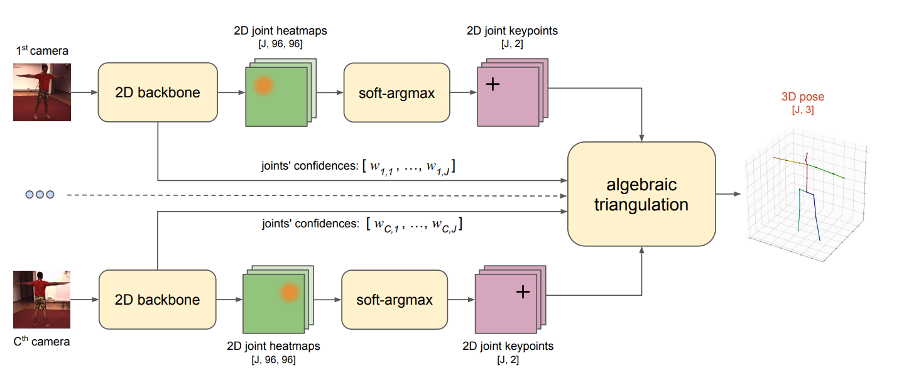
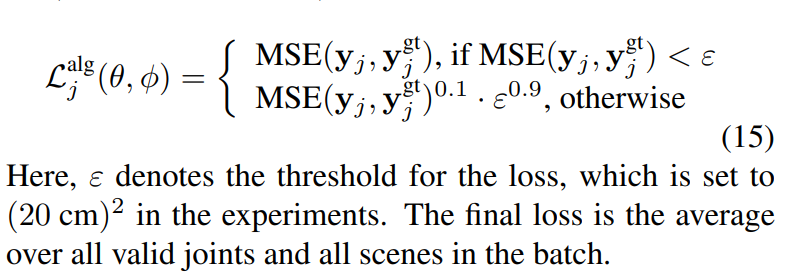
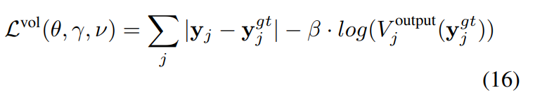
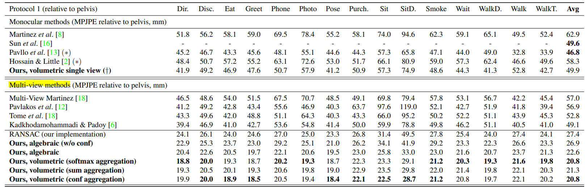
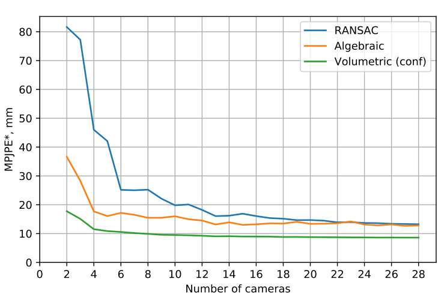

# [Learnable Triangulation of Human Pose](https://arxiv.org/pdf/1905.05754v1.pdf)
[pytorch 공식 깃헙](https://github.com/karfly/learnable-triangulation-pytorch)

의역 및 오역 다수

## Abstract

다시점 3D human pose estimation에 대한 두 가지의 새로운 솔루션을 제안한다.  

이 둘은 여러 개의 2D view로부터 3D 정보를 합성하는 새로운 Learnable Triangulation 방법을 기반으로 한 방법이다.  

첫번째 baseline 솔루션은 미분 가능한 기본 대수 삼각 분할로서, 입력 이미지로부터 신뢰 가중치(confidence weights)를 추가한 것이다.  

두번째 솔루션은 intermediate 2D backbone feature map 에서 새로운 볼륨 집계 방법을 기반으로한다.  

집계된 볼륨은 3D convolutions를 거쳐 최종 3D joint heatmap을 생성하고 human pose prior modelling을 돕는다.  

여기서 중요한 점은 위 두 방법 모두 end-to-end, 즉 종단간 미분 가능한 방법이며, 이로인해 target metric을 직접 최적화 할 수 있게 된다는 것이다.  

본 연구는 Humans3.6M dataset에서 SOTA 성능을 달성하였다.  

## Introduction

### 카메라 한 대 말고 여러 대를 쓰자
현재까지 대부분의 연구는 단시점 자세 측정(monocular 3D pose estimation)에 치중되어 있다.

> :question: [monocular 3D human pose estimation](https://link.springer.com/10.1007%2F978-0-387-31439-6_584)란 통상적으로 하나의 모노 이미지(monocular image)에서 3D 자세 정보를 추출하는 것을 이른다.  
c.f) 스테레오 이미지란 카메라 2개로 촬영된 이미지이다.

그러나 실무에서는 단시점 자세 측정은 사용하기에 문제가 많다.  

이에 다시점 자세 측정(multi-view human pose estimation)이 흥미로운 이유를 두 가지 들어보자면,

1. 다시점 자세 측정은 단시점 자세 측정의 실제 정답 값(ground truth)을 얻기 위한 가장 좋은 방법이다.  
왜냐하면 다시점 자세 측정의 경쟁 기술이라고 할 수 있는 마커 기반 모션캡처(marker-based motion capture)와 관성 센서 기법(visual-inertial method)은 다양한 의상과 풍부한 자세 표현을 캡처하는데에 한계가 있기 때문이다.  
다만 다시점 자세 측정의 단점은 이전 연구들이 multi-view triangulation 데이터셋을 구축할 때 과도한, 거의 불가능한 수의 view (camera)를 이용하여 양질의 3D 정답값을 구하였다는 점이다.  
이 방법으로 실무에서 쓰일 수 있는 새로운 3D pose estimation 데이터셋을 구축하는 것은 매우 도전적이며, 따라서 정확한 triangulation을 통해 view의 수를 몇 대 수준으로 줄일 수 밖에 없다.  

2. 다시점 자세 측정이 흥미로운 두 번째 이유는 몇몇 제한된 환경에서 실시간 자세 측정이 가능하기 때문이다.  
이것이 가능한 이유는 여러 대의 카메라를 이용하는 환경이 실생활에서 점진적으로 증가하고 있기 때문이다. 예를들면 스포츠 경기 또는 장애인 컴퓨터 보조 기기 등이 있다.  
이러한 상황에서 현대의 다시점 기법의 정확도가 기존 잘 연구된 단시점 기법의 정확도에 비견할 정도로 성장하고 있다.  

본고에서는 다시점 자세 측정이 그 중요성에 비해 거의 관심을 받지 못하고 있음을 주장하는 바이다.  
본고는 두 가지의 연관된 기법을 사용하여 다시점 자세 측정을 제안하고 연구하였다.  
두 방법 모두 learnable triangulation, 학습가능한 삼각측량법을 사용한다.  
학습가능 삼각측량법을 이용하면 3D 자세를 정확히 측정하기 위해 필요한 카메라(view)수를 현저히 줄일 수 있다.  
학습 과정 중에 우리는 마커 기반 모션 캡처로 얻은 정답값 또는 과도한 수의 view를 사용하여 얻은 메타 정답값(meta ground truth)을 사용하였다.  

두 방법은 다음과 같다.  
1. camera-joint confidence weights를 학습매개변수로 한 대수 삼각측량법 접근으로 더 간단한 방법.
2. 정보의 밀도 분포에 대한 기하학적 집계에 기반한 볼륨 삼각 측량 접근 방식으로 더 복잡하지만 자세 사전 확률 모델링(modelling a human pose prior)이 가능한 방법.  
중요한 점은 두 방법 모든 과정에서 완전히 미분가능하다는 것이다.

지금부터 단시점 및 다시점 자세 측정에 관한 관련 연구를 리뷰한 다음, 본고의 연구에 대해 자세히 이야기 하도록 하겠다.

본고의 실험 파트에서, 우리는 유명한 데이터셋인 Humans3.6M 및 CMU Panoptic 데이터셋을 사용하였으며, 제안한 기법을 이용하여 SOTA 성능 및 범데이터셋 일반화 가능성을 보였다.

## Related Work

### Single view 3D pose estimation
현재 단시점 3D 자세측정 분야의 SOTA 기술은 크게 두가지로 분류할 수 있다.  
1. 고화질 2D 자세측정 엔진에서 추출한 2D 좌표를 심층신경망을 통해 3D 좌표로 개별 변환하는 것이다.  
이는 < A simple yet effective baseline for 3d human pose estimation > 논문에서 대중화되었으며  
간단하고, 빠르고, 모션캡처 데이터로 훈련할 수 있으며 훈련 후에 2D 백본 엔진을 교체할 수 있다는 장점이 있다.
2. 컨벌루션 신경망을 사용하여 2D 이미지에서 직접 3D 좌표를 추출하는 것이다.  
현존하는 가장 좋은 솔루션은 < Integral human pose regression >로 자세의 volumetric representation을 이용한다.  
이는 Humans3.6M의 single-frame SOTA 결과와 함께 가장 좋은 솔루션으로 꼽힌다.

### Multi-view view 3D pose estimation
다시점 연구는 일반적으로 단시점 3D 자세 측정의 정답값을 얻는 것을 목표로 한다.  
예를 들면 < Learning Monocular 3D Human Pose Estimation from Multi-view Images. >, <  Panoptic studio: A massively multiview system for social interaction capture > 등의 연구가 있다.  

< A generalizable approach for multi-view 3D human pose regression. > 연구에서는 모든 시점의 연동되는 2D 좌표값을 concatenate  하여 FC 네트워크에 배치로 입력한 뒤, global 3D joint 좌표를 예측할 것을 제안하였다.  
이러한 접근방식은 각기 다른 시점의 정보를 효율적으로 사용할 수 있으며 모션 캡처 데이터를 학습할 수 있다는 장점이 있다. 그러나, 이 방법은 설계상 학습된 모델을 새로운 카메라 환경에서 사용하기가 어려우며, 저자는 이 방식이 오버피팅 경향을 강하게 가진다는 것을 보였다.  

volumetric 자세 표현을 다시점 환경에서 사용하는 연구가 드물게 있다.  
< Harvesting multiple views for marker-less 3D human pose
annotations >, <  Panoptic studio: A massively multiview system for social interaction capture > 연구가 그것이며,  
특히 Panoptic studio 연구의 경우 2D 키포인트 확률 히트맵을 역산출하여 후속 학습이 불가능한 volume aggregation으로 활용하였다.

우리의 연구는 이와 두 가지 방식에서 다르다.  
첫째로, 우리는 volume 내부에서 정보를 처리하며 학습가능한 방식으로 한다.  
둘째로, 우리는 end-to-end training 가능한 네트워크를 사용하며, 2D 백본 엔진을 조정하여 2D 히트맵을 해석할 필요가 낮아진다.  
이는 몇몇 2D 추정기로부터 각각의 일관된 자세 가설(hypotheses)을 체적 집계(volumetric aggregation)된 단계로 끌어올릴 수 있도록 한다. (이전의 설계에서는 불가능했다.)  

< Rethinking Pose in 3D: Multi-stage Refinement and Recovery for Markerless Motion Capture. > 연구는 외부의(<  Lifting from the deep: Convolutional 3d pose estimation from a single image. >) 3D 자세 사전확률과 함께 다층적 접근 방식을 사용하여 2D 조인트 좌표로부터 3D 좌표값을 얻었다.  
첫 단계에서는 모든 시점의 이미지가 백본 CNN에 통과되며 2D 조인트 히트맵을 얻는다.  
히트맵의 최대값들의 위치는 3D 사전 확률 공간의 잠재 좌표를 최적화하는 과정을 통해 3D 자세를 추정하는 데에 사용된다.  
그 다음, 해당 3D 자세는 히트맵 최대값의 위치로부터 재산출되고, 위 과정이 반복된다.  
이러한 과정을 통해 간접적 전체적 추론(indirect holistic reasoning) 방식을 사용하여 2D 조인트 히트맵의 예측값을 조정할 수 있게 된다.  
우리의 접근 방식과는 반대로, Rethingking Pose in 3D 연구에는 3D 예측값과 2D 히트맵 사이의 gradient flow가 없으므로 3D 좌표 예측값을 수정하기 위한 시그널이 없다.  

## Method
본고의 접근방식은 카메라 C의 비디오가 이미 알고있는 projection matrices P_c와 동기화하여 화면 상의 한 사람의 동작을 캡처한다고 가정한다.  
본고는 시점 t와 j ∈ (1 ..J )로 고정된 human joint 집합의 global 3D position인 y_j, t 를 계산하는 것을 목표로 한다.  
각 시점에서 frame은 독립적으로 처리되며(즉, 시간 정보를 사용하지 않고 처리되며) 따라서 명확성을 위해 t 인덱스는 생략한다.  
각 frame에서 우리는 이미지상의 bounding box를 이용하여 이미지들을 crop하는데, 이 bounding box는 기성 2D human detector 모듈을 이용하거나 정답값이 있는 경우 정답값을 이용하였다.  
그런 다음 crop된 이미지 셋인 I_c를 심층 CNN backbone에 집어넣는다. 이 CNN backbone은 < Simple baselines for human pose estimation and tracking. > 논문의 간단한 baseline 모델 아키텍처에 기반한 것이다.  
CNN backbone과 학습 가능 가중치인 θ는 ResNet-152 네트워크(output은 g_θ)와 일련의 전치된 Convolution 레이어들(중간 히트맵을 생성하며 output은 f_θ), 그리고 1x1 커널의 CNN (중간 히트맵을 해석가능한 조인트 히트맵으로 변환하며 output은 h_θ, output channel 의 개수는 joint J와 같음)으로 구성된다.  
다음 두 섹션에서 두 가지 다른 방식으로 다시점 정보를 집약하여 joints' 3D coordinate을 추론하는 것을 보이겠다.

### Algebraic triangulation approach 대수적 삼각 측량법
대수 삼각 측량법은 baseline method로 선정하였다.  
본고에서는 각 joint j들을 서로에 대해 독립적으로 처리한다.  
이 방식은 다른 시점에서 얻은 joint j의 백본 히트맵 상의 2D 위치를 삼각 측량하여 구축된다.

### Volumetric triangulation approach 체적 삼각 측량법
baseline 대수 삼각 측량법의 한가지 장애물은 서로 다른 시점의 카메라에서 생산된 이미지가 독립적으로 처리되므로, 3D 자세 사전 확률을 추가하거나 잘못된 projection matrix를 가진 카메라를 filter out 할 방법이 없다는 것이다.  

이 방법을 해결하기 위해 더 복잡하고 강력한 삼각측량 과정을 도입한다.  
우리는 2D backbone에서 생산된 feature map을 3D volume으로 역투영(unproject)한다.  
이는 사람 주변에 3D 큐브를 그리고 그것을 2D backbone output의 투사값으로 채우면서 진행된다.  
다양한 시점에서 얻어진 큐브는 합쳐져 처리된다.  
이 떄 2D backbone output은 2D joint heatmap일 필요가 없다.  

### 오차함수
위 두 방법 모두 gradient가 3D joint 좌표 예측값으로부터 input RGB 이미지 셋까지 전달될 수 있으므로 end-to-end 훈련이 가능하다.  

대수 삼각 측량법의 경우, 오차함수로 soft version of per-joint MSE loss 를 사용하여 극단값에 잘 대비할 수 있도록 하였다.  

볼륨 삼각 측량법의 경우 L1 loss에 약한 히트맵 정규식을 가미하여 정답값을 내포한 voxel 예측치를 극대화하도록 하였다.

우변의 두번째 항이 없으면, 볼륨 히트맵은 해독이 불가능하며 이는 학습데이터가 부족하기 때문인 것으로 사료된다. 베타값을 충분히 작게 (0.01) 하면 해독이 가능하며, 이는 산출된 히트맵이 항상 현저한 최고점에 근접한 예측치를 갖기 때문이다.  
동시에 그렇게 작은 베타값은 최종 성과 지표에 별 영향이 없으므로 해독이 필요없다면 사용하지 않아도 상관 없다.

## Experiments
3D 자세 측정 정답값을 가진 두 개의 다시점 데이터셋을 사용하였다 : Humans3.6M, CMU Panoptic

### Human3.6M Dataset
이 데이터의 2D backbone은 COCO 데이터셋으로 훈련되었으며 MPII 와 Human3.6M으로 Adam optimizer를 사용하여 10^-4의 학습률로 10 epochs 동안 finetuning 하였다.  
3D 정답값과 카메라 파라미터는 < A simple yet effective baseline for 3d human pose estimation. >에서 제공하고 있다.  
비디오 프레임마다 grid-sampling을 적용하여 이미지 왜곡을 없앴다.  
다른 언급이 없다면 모든 신경망은 4개의 카메라를 이용하여 훈련하였다.  

위는 골반에 대한 MPJPE error 값 비교표이며 본고가 SOTA 성능을 달성하였다.

### CMU Panoptic data
이는 CMU에서 제공하는 새로운 다시점 데이터이다.

## Conclusion
이 접근방식의 주요 한계 중 하나는 화면 당 한 사람만 지원한다는 것이다.  
이 문제는 2D human detection에 사용되는 ReID 솔루션을 사용하여 완화할 수 있다.  

volume 삼각 측량법의 또 다른 한계는 대수 삼각 측량의 예측값에 의존한다는 것이다.  
따라서 골반을 관찰하는 카메라 뷰가 2개 이상 있어야 하는데, 이는 일부 상황에서 문제가 될 수 있다.  

이 방법의 성능은 < Rethinking Pose in 3D: Multi-stage Refinement and Recovery for Markerless Motion Capture. > 와 유사한 방식으로 다층적 접근법을 추가하여 잠재적으로 향상될 수 있다.