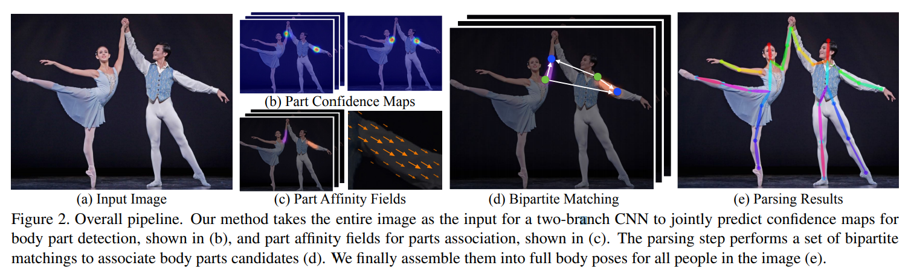

# [Realtime Multi-Person 2D Pose Estimation using Part Affinity Fields](https://arxiv.org/pdf/1611.08050v2.pdf)

[official codebase](https://github.com/ZheC/Realtime_Multi-Person_Pose_Estimation)  

의역 및 오역 다수

## Abstract

한 이미지 내의 여러 사람에 대한 2D 자세를 탐지하는 효율적인 접근방식을 소개한다.  
이 접근방식은 우리가 PAFs(Part Affinity Fields) 라고 부르는 *비모수 표현법**(non-parametric representation)을 사용하여 개개인의 신체 부위를 연결한다.  
이 아키텍처는 global context를 인코딩하여 사람 수에 관계 없이 높은 정확도로 실시간 탐지를 가능하게 하는 greedy bottom-up parsing step을 가능하게 한다.  

    :question: 비모수 표현법 (non-parametric representation)
    선험적 확률에 의존하지 않고 주어진 데이터에서 직접 확률을 계산하여 검정하는 방식

이 아키텍처는 동일한 순차 예측 프로세스의 두 분기를 통해 동시에 부분 위치와 각 부분간의 연관성을 학습하도록 설계되었다.  
우리의 방법은 inaugural COCO 2016 keypoints challenge에서 1위를 달성하였으며, MPII Multi-Person benchmark 에서 performance와 efficiency 두 부문에서 SOTA 성능을 현저히 능가하였다.  

## Introduction

2D 인간 자세 측정 연구들은 대부분 해부학적 키포인트 또는 부위를 특정하는 것을 목적으로 하여 개인의 신체 부위를 찾는 데에 집중하고 있다.  
한 이미지 내의 여러 사람들의 자세를 추론하는 것은, 특히 그 사람들이 사회적 참여 행동을 하는 경우, 다른 경우와는 달리 특이한 문제가 몇 가지 발생한다.  

첫째, 각 이미지는 특정할 수 없는 위치에 특정할 수 없는 크기로 특정할 수 없는 횟수만큼의 사람들을 포함한다.  

둘째, 사람들 사이의 상호작용이 복잡한 공간적 추론을 야기한다. 접촉, 가림, 관절의 움직임 등이 신체 부위를 특정하는 데에 어려움을 가중시킨다.  

셋째, 런타임 복잡도가 사람 수에 따라 증가하는 경향이 있으며, 이는 실시간 퍼포먼스에 악영향을 끼친다.  

이를 해결하기 위한 대부분의 접근방식은 인체 탐지기를 이용하여 인체가 인식 될 때마다 단일 인체 자세 측정을 수행하는 것이다.  
이러한 top-down 접근방식은 현존하는 단일 인체 자세 측정 기술을 직접적으로 활용하고 있다.  
그러나 early commitment 문제를 겪을 수 있다.   
즉, 인체 탐지기는 사람 사이의 거리가 가까울 경우 실패하기 쉬운데, 그럴 경우 복구할 방법이 없다.  
또한 이러한 top-down 접근방식은 런타임 리소스 사용률이 사람의 수에 비례한다. 각각의 탐지마다, 단일 인체 자세 측정이 수행되고, 사람이 더 많을 수록 컴퓨팅 리소스가 많이 소비된다.  

반면 bottom-up 접근방식은 위와 같은 early commitment 문제에 강하면서 런타임 복잡도는 사람 수에 상관없이 설정할 잠재력이 있다는 점에서 매력적이다.  
그러나, bottom-up 접근방식은 다른 신체 부위 및 다른 사람들의 맥락 정보(global contextual cue)를 직접 사용하지 않는다.  
실무에서 bottom-up 접근방식은 최종 parse 작업이 비싼 global 추론을 필요로 했기 때문에 효율성 면에서 유리하지 못했다.  

본고에서, 우리는 다인체 자세 측정 분야에서 다수의 공공 benchmark의 SOTA 성능을 달성한 효율적인 방법을 소개하고자 한다.  
우리는 PAFs라는 2D 벡터 필드셋을 이용하여, 이미지 도메인에서 사지의 위치와 방향을 자세추정 점수로 인코딩하는 첫번째 bottom-up 표현 방식을 소개한다.   
우리는 탐지, 그리고 자세추정 bottom-up 표현을 동시해 추론하는 것이 global context를 충분히 잘 인코딩한다는 것을 보일 것이다.  
또한 소모되는 컴퓨팅 리소스에 비해 greedy parse가 고품질의 성과를 달성한다는 것을 보일 것이다.  

## Method

