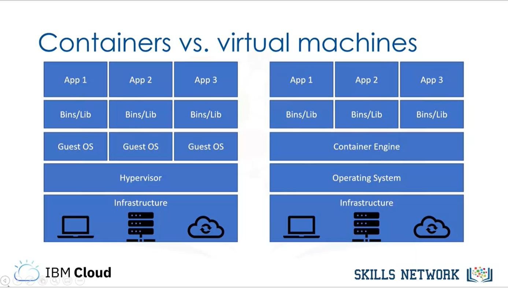
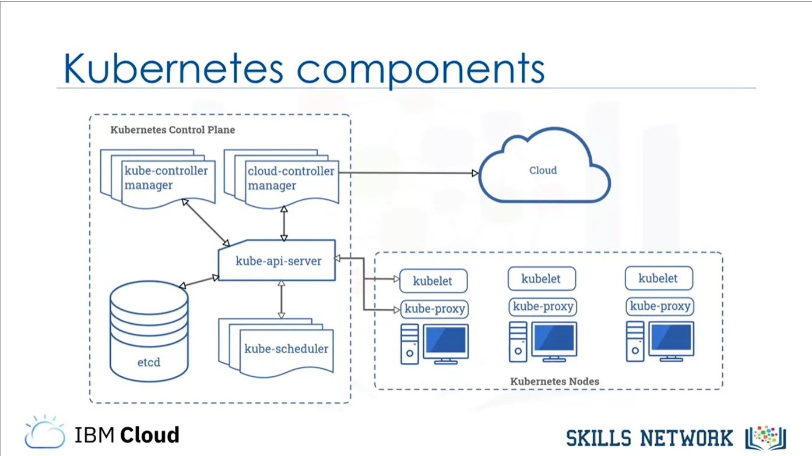

# Introduction to Containers w/ Docker, Kubernetes & OpenShift
[Coursera Lecture](https://www.coursera.org/learn/ibm-containers-docker-kubernetes-openshift/home/welcome)

## Why Learn This?
- 리눅스 다음으로 pull request & isuue 수가 많은 Kubernetis 플랫폼
- 기업들이 점점 많이 사용하고 있으며 필수 기술로 자리잡고 있는 Docker

## Introduction to Containers
- **Container?**  
    executable unit of software in which application code is packaged, along with its libraries and dependencies, in common ways so that it can be run anywhere, whether on a desktop, on-premises, or in the cloud.  
    즉, **어떤 환경에서나 실행 가능하도록 코드,라이브러리,애플리케이션 등 필요한 모든 것을 한번에 담은 집합체**

- **Container & Virtualization**  
    위 목적을 달성하기 위해 OS-level 가상화가 이루어진다.

- **Container VS Virtual Machine**  
    VM과는 달리 빠르고, 작고, portable하다.  
    이유는 각각의 instance가 guest OS를 포함하는 대신 host OS의 기능과 리소스를 이용하는 방식으로 동작하기 때문

    즉, Infrastructure가 아닌 OS를 가상화 하여 저장공간을 확보한다.  
    

    이는 실행환경에 맞춰 configuration을 수정할 필요가 없다는 편의성을 제공한다.

- **Conatainer & Shipping container**  
    선박 컨테이너가 생기기 전, 물건의 크기는 모두 제각각이었으며 이로인한 운반의 복잡성과 비효율성이 존재하였다.  

    선박 컨테이너는 운반할 물건의 자유도를 보장하면서 동시에 운반 효율을 높이는 일종의 "규약"이다.  

## Introduction to Docker
- **Docker**
    - container를 만드는 소프트웨어 플랫폼  
        - 보통 image, container라고 하면 Docker image, Docker container를 가리킨다.
    - container를 실행하는 runtime  
- **유용한 CLI commands**
    - `docker build` : 이미지 생성
    - `docker tag` : 이미지 복사 및 이름 지정
    - `docker images` : 이미지 목록
    - `docker push` , `docker pull` : remote location에 이미지를 저장하거나 불러옴
    - `docker run` : 도커 컨테이너를 실행하는 런타임

## Build Docker images
- **개발 프로세스**  
    도커파일(c.f. blueprint) -> 이미지(c.f. class) 빌드 -> 컨테이너(c.f. instance) 생성
- **Layer**  
    이미지는 몇 개의 Read-only image layer로 구성된다.  
    컨테이너를 실행하면, 그 Read-only image layers 위에 writable container layer가 추가된다.  
    각 이미지 레이어는 여러 이미지에서 공유하여 사용할 수 있다.  
- **Dockerfile instruction**
    - 아래 각각의 instruction은 이전 instruction 위에 쌓이는 하나의 layer이다.
    - `FROM`
        - define base image
    - `RUN`
        - execute commands
    - `ENV`
        - set environment variables
    - `ADD`, `COPY`
        - copy local files into image
        - `ADD` can also add files from remote URLs
    - `CMD`
        - 도커파일 당 한번만 사용. 두번 이상 사용시 마지막 command만 실행
        - provide default action for running container

- **Container Registry**
    - 이름을 붙인 컨테이너 이미지를 쉽게 저장하고 배포할 수 있는 저장소
    - 이미지를 저장소에 `push` 한다, 이미지를 저장소에서 `pull` 한다고 이야기 한다. 
    - 깃헙, 또는 PYPI 등 라이브러리 게시 공간을 생각하면 편할 듯
    - public registry의 한 예 : IBM Cloud Container Registry
    - 기업의 경우 private container registry를 직접 만들어 관리하는 경우가 많음
    - `push`는 개발자 개인 또는 시스템 pipeline에 따라 실행되고, `pull`은 주로 Kubernetes와 같은 시스템에서 사용된다.  
    - '이름을 붙인' 컨테이너 이미지. 즉 이미지에 이름이 있어야 한다. 
        - 도커 이미지 이름 = `hostname/repository:tag` (e.g. `docker.io/ubuntu:18.04`)
            - **hostname** : registry를 push할 장소 (docker.io, us.icr.io 등)
            - **repository** : 관련 있는 docker container의 그룹. 예를 들면 같은 어플리케이션의 다른 버젼 컨테이너들. 따라서 서비스 명이나 어플리케이션 명으로 짓는다.
            - **tag** : 주로 버젼 넘버 또는 이미지 특성(OS 종류 등)
        - docker.io는 생략가능하다. 따라서, `docker pull ubuntu:18.04`로 간단하게 명령할 수 있음.
    - 이러한 기본 기능 외에도 이미지 오류 검사, 보안, Kubernetes 등 다양한 추가 기능을 제공하는 registry들이 있다.  

- **Build image**
    - `docker build -t my-app:v1 .` : docker, build an image named(-t) host:docker.io, repository:my-app, tag:v1 and save it here(.).
    - `docker tag my-app:v1 second-app:v1` : docker, copy and tag a new name to it.
    - `docker run my-app:v1` : create container and run

## Understand Kubernetes Architecture
### Container Orchestration
- 개발하면서 점점 많아지는 컨테이너를 어떻게 감당할 것인가
- Container에 lifecycle을 주고 싶다. 
- Container Ochestration과 관련된 여섯가지 주제들
    1. 프로비저닝 및 배포 자동화
    2. 애플리케이션이 중단되지 않도록 redundancy & availability 보장
    3. 스케일링 및 로드밸런싱
    4. 스케쥴링
    5. 업데이트
    6. 애플리케이션이 잘 실행되고 있는지 주기적으로 확인 & 아닐 시 복구처리
- 대표적인 Container Orchestration tool이 바로 **Kubernetes**
- **Kubernetes**
    - [O] 오픈소스
    - [O] Container Orchestration Platform
    - [O] 원하는 상태 지정 가능 (e.g. 특정 애플리케이션의 4카피를 유지할 것)
    - [O] 확장 프로그램 등이 다양함
    - [O] 다양한 환경에 구축 가능
    - [X] 소스코드 배포 및 애플리케이션 빌드는 할 수 없음
    - [X] logging, monitoring, alert 서비스 없음
    - [X] 미들웨어, 데이터베이스 등 제공하지 않음

- **Kubernetes Architecture**
    
    - Kubernetes Cluster : 쿠버네티스 기본 배포 단위
    - Cluster의 구성 요소
        - Control Plan : Make global decisions on cluster
            - Kubernetis API server : 외부와 소통
            - Etcd : 모든 클러스터 데이터(configurations, states) 저장
            - Kubernetes scheduler : Nodes에 Pods를 배분
            - Kubernetes controller manager : Controller 관리
            - Cloud controller manager : cloud provider에 cluster를 연결
        - Nodes : computing resource usually provided by cloud provider
            - worker machine
            - control plane에 의해 관리됨
            - Kubelet : API 서버와 소통하며 Pods를 받고 Pods가 ㄱ잘 작동하는지 감시하며 주기적으로 control plane에 status 와 health 전송
            - Container runtime Interface : Docker, rkt, CRI-O등의 컨테이너 런타임을 adopt할 수 있음
            - Kube-proxy : Pods와 소통하는 네트워크 규칙 정비

- **Controller**
    - 클러스터 내에서 무한 루프를 돌며 원하는 state를 보장하는 요소
    - 모니터링 중 원하는 state와 현재 state 사이에 차이 발생하면
    - API 서버에 전달하여 필요한 액션을 요구함

- **Kubernetes objects의 정의**
    - persistent entities 즉, 사용자가 명시적으로 지우지 않는 한 Kubernetes는 이 object가 시스템 내에 항상 존재함을 보장한다.
    - Pods, namespaces, Deployments, ConfigMaps, volumes는 Kubernetes object 중 한 종류이다.
    - Kubernetes objects를 이용(CRUD)하기 위해서는 Kubernetes API를 이용한다.
    - 흔히 kubectl CLI API를 이용한다.
    - 모든 Kubernetes object는 두 파트로 나뉘어진다 : spec, status
        - spec : 유저가 지정한 desired state
        - status : Kubernetes가 보고하는 object의 현재 상태
    - Namespaces
        - virtualization of a physical cluster
        - 하나의 physical cluster위에서 일부 또는 전체 component에 대하여 여러 개의 namespaces를 선언할 수 있음
        - kube-system : 기본 namespace
        - 팀별, 프로젝트별로 개별 namespace를 만들 수 있음

- **Kubernetes objects의 종류**
    - **Pod**  
        Kubernetes의 가장 간단한  단위  
        클러스터에서 실행하는 프로세스를 지칭함.  
        하나의 컨테이너 또는 여러개의 컨테이너로 이루어짐.  
        Pod를 복제하여 application horizontal scaling이 이루어짐
        YAML 파일에 정의한다.
        ```
        apiVersion: v1
        kind: Pod
        metadataa:
            name: nginx
        spec:
            containers:
            -name: nginx
             image: nginx:1.7.9
             ports:
             - containerPort: 80
        ```
    - **ReplicaSet**  
        애플리케이션의 scaling을 도와준다.  
        YAML 파일에 유지할 Pod의 개수를 정의하면 그대로 유지하기 위해 삭제 또는 복제 작업을 수행한다.  
        Deployment를 생성할 때 자동으로 하나가 생기므로 수동으로 YAML파일을 사용할 필요는 없다.  
    - **Autoscaling**  
        Horizontal Pod Autoscaler(HPA)를 사용하여 min, max 값 사이로 Pod 개수의 범위를 지정할 수도 있다.  
    - **Rolling Updates**  
        자동으로 제어되는 애플리케이션의 변경사항을 롤백/롤아웃할 수 있음.
    - **ConfigMaps**  
        포트번호, 에러메시지 등 환경변수를 하드코딩하지 않도록 따로 저장한다.  
        서로 다른 deployment에 재사용할 수 있다.  
        string literal, key value file, YAML 파일을 통해 만들 수 있다.  
        - string literal :   
        Configmap 만들기 : `kubectl create configmap my-config --from-literal=MESSAGE="hello"`  
        Configmap ls : `kubectl get configmaps`  
        Configmap 상세보기 : `kubectl describe configmap my-config`  
        - file :  
        Configmap 만들기 : `k create cm my-config --from-file=myconfig.txt`   
    - **Secrets**  
        API 크레딧 번호 등의 정보를 저장할 때 사용할 수 있음.  
        ConfigMap과 비슷하지만 `kubectl describe`에서 정보가 표시되지 않음
    - **Service binding**  
        외부 서비스와 연동할 수 있음